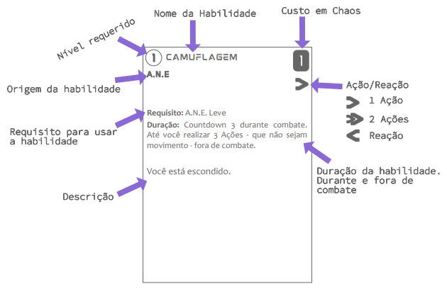

Habilidades podem ser passivas, engatilhas ou ativas. Habilidades são exclusivas de espécie e, algumas vezes, de caminho.

## Habilidades Passivas

Habilidades Passivas são características e/ou efeitos que estão sempre ativos. Exemplos:

- Ao escolher um aprimoramento que lhe dá um estômago reforçado, você recebe a seguinte passiva:
    - Você pode consumir qualquer tipo de criatura orgânica e em qualquer estado de decomposição, ignorando qualquer efeito nocivo a sua saúde.
- Você escolhe uma espécie que lhe permite respirar embaixo da água, além da superfície.

## Habilidades Engatilhadas

Habilidades Engatilhadas serão ativadas no momento que um ou mais gatilhos se tornarem verdade. Fazem bastante uso de palavras chaves como <ins>sempre</ins> ou <ins>quando</ins>. Exemplos:

- <ins>Sempre</ins> que você causar dano com esta arma, você pode derrubar a criatura alvo.
- <ins>Quando</ins> você realizar o primeiro descanso curto do dia, recupere 2 AP adicionais.

## Habilidades Ativas

Habilidades ativas são Ações/Reações especiais com efeitos poderosos. Geralmente possuem custo em [Caos](./resilience.md#caos) e/ou [Stress](./resilience.md#stress). Exemplos:

- 1 Caos: Faça um ataque com esta arma em todos os inimigos na sua Seção.
- 2 Caos: Faça um ataque com esta arma em todos os inimigos até distância Longe. Ignore AP ao causar o dano.

Para mais informações sobre o uso de Habilidades Ativas, veja [aqui](../actions.md#usar-habilidade).  

## Apresentação

<figure markdown="span">
  
  <!-- <figcaption>Image caption</figcaption> -->
</figure>