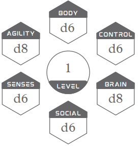

<figure markdown="span">
  
</figure>

Atributos representam suas características físicas e mentais. Abaixo você encontra os seis atributos bases: Corpo, Agilidade, Controle, Sentidos, Cérebro e Social. Ao lado do nome de cada um, segue exemplos de ações que você pode executar, sendo elas apenas inspirações, não se limite a elas. O uso de atributos para ações é <ins>dinâmico</ins> e depende do contexto, exemplos:

_Quer intimidar uma criatura com ameaças verbais? Use Social.  
Quer intimidar a criatura quebrando algum objeto e ameaçando apenas com sua presença? Use Corpo._ 

_Quer desativar um dipositivo digital tentando hack? Use Cérebro.   
Quer desativar um dispositivo digital abrindo-o e mexendo em seus componentes? Use Controle._  

<!-- { align=center } -->

<!-- <figure markdown="span">
  { width="100" }
  { width="100" }
  { width="100" }
  { width="100" }
</figure> -->

{ width="100" }
{ width="100" }
{ width="100" }
{ width="100" }

### CORPO: Elevar, Agarrar, Quebrar

Corpo indica o quão forte e resiliente você é, sua força física e sua fortitude do corpo, quanta punição física você pode suportar. Você irá realizar checks de Corpo para atacar com armas pesadas, quebrar uma porta, levantar objetos ou criaturas, ou prender alguém.  

### AGILIDADE: Esquivar, Saltar, Esgueirar

Agilidade indica o quão rápido você é, sua mobilidade em terrenos difíceis, reflexos e velocidade de reação a perigos. Também indica o quão bom você é ao se esgueirar e esconder. Você irá realizar checks de Agilidade para atacar com armas leves, subir uma corda, saltar entre telhados, fugir das garras de inimigos, esgueirar ou se esconder de inimigos, ou esquivar de um ataque.  
   
### CONTROLE: Atirar, Pilotar, Crafting

Controle indica o quão hábil e preciso você é. Você irá realizar checks de Controle para tarefas que necessitam de um bom controle motor do corpo; como ser preciso ao atacar com armas de longo alcance, cuidadoso e habilidoso ao usar ferramentas, ou mexer em dispositivos mecânicos ou digitais.  

### SENTIDOS: Perceber, Sentir, Procurar

Sentidos indica o quão apurado são seus sentidos, e o quão você é atento a detalhes ao seu redor. Você irá realizar checks de Sentidos para perceber perigos, procurar e notar detalhes no ambiente ao seu redor, notar se alguma criatura está escondida, ou rastrear uma criatura ou objeto.

### CÉREBRO: Lembrar, Analisar, Compreender

Cérebro indica o quão bom você é ao deduzir e inferir informações para resolução de problemas complexos, seu conhecimento e memória e sua calma perante momentos estressantes. Você irá realizar checks de Cérebro para interpretar fatos, resolver problemas complexos, enxergar padrões, ou relembrar informações importantes.  

### SOCIAL: Persuardir, Manipular, Performar

Social indica o quão influente você é socialmente, sua força de personalidade, sua presença quanto a perigo e outras situações. Você irá realizar checks de Social para persuardir, enganar, intimidar ou manipular uma criatura, seja ela racional ou não.  