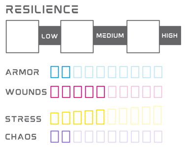

# Resiliência

Resiliência representa um conjunto de características que determinam sua fortitude física, mental e capacidade de uso de habilidades.

### Limites de Dano

Limites de Dano são valores numéricos associados a Leve, Alto e Severo. Quando você recebe dano, você deve comparar o valor com seus limites de dano e então marcar o número de AP/Feridas correspondente.

- **Dano abaixo de Leve:** você não recebe dano.
- **Dano Leve:** marque 1 AP/Ferida.
- **Dano Alto:** marque 2 AP/Feridas.
- **Dano Severo:** marque 3 AP/Feridas.

### Armadura (AP)

Armadura (AP) aparece quando você tem armadura, seja ela um equipamento ou natural. Seu tipo de armadura determina a quantidade de AP que você tem. Quando você recebe dano, caso tenha AP, você irá marcar de 1 a 3 AP, representando o quanto sua armadura foi danificada.

Você pode recuperar Armadura a partir de diversas fontes, como: Descanso, itens, habilidades, etc.

Quando você marcar seu último AP, narrativamente, sua armadura está inativa. Mecanicamente, nada acontece, a não ser que dito o contrário.

### Feridas

Feridas representam lesões físicas e ferimentos experienciados por um personagem durante a aventura. A quantidade de pontos de Ferida variam entre as espécies e suas peculiariedades. Quando você recebe dano, você irá marcar de 1 a 3 Feridas, representando o quanto de vida você perdeu. Caso você tenha AP, o dano é primeiramente diminuído de lá, a não ser que a fonte de dano diga o contrário.

Você pode recuperar Feridas a partir de diversas fontes, como: Descanso, itens, habilidades, etc.

Quando você marcar sua última Ferida, você deve rolar um dado e comparar com a tabela de Ferimentos Críticos, para saber o que acontece com seu personagem. O dado e a tabela variam entre espécies.

<!-- ### Marcando AP e Ferida

Quando o GM lhe diz para receber dano, compare o valor do dano com os limites e marque a quantidade de AP ou Ferida de acordo com o nível de dano:

Se você marcar seu último AP, narrativamente sua armadura fica danificada, mecanicamente você fica sem AP até recuperá-lo de alguma forma. AP pode ser recuperado de forma automática ao longo do tempo, ou através de consertos, habilidades, recursos, etc. A maneira que isto acontece depende de sua espécie e armadura.

Se você marcar sua última Ferida, você sofre um ferimento crítico - veja mais em [Ferimento Crítico](../combat/damage.md#ferimentos-críticos).

<!-- imediatamente deve fazer uma ação de [Morte](./death.md#morte). -->

<!-- Durante descansos ou através do uso de algum item, habilidade ou recurso, você poderá recuperar AP ou Ferida, assim apagando a marca da sua ficha. --> -->

## Stress

Stress representa seu estado mental, o quão estressado, desgastado você está mentalmente. Ao longo da aventura, você pode receber danos que podem ir direto para seu stress. Algumas situações também podem lhe desgastar, deixando-o com stress - como uma falha em um momento crítico do jogo. Quando você recebe dano em Stress, esse dano é causado diretamente no marcador, sem se beneficiar da mecânica de Limites de Dano ou AP.

Você pode receber Stress quando:  

- Alguma Ação/Reação de uma criatura contra você, armadilha, dispositivo ou qualquer outro tipo de perigo, diga explicitamente que causa dano em Stress.
- Você realiza alguma Ação/Reação que explicitamente diga que você recebe Stress.
- O GM indica que você deve receber Stress como consequência de qualquer ato ou efeito externo.

Você pode recuperar Stress a partir de diversas fontes, como: Descanso, itens, habilidades, etc.

Quando você marca um Stress a mais que metade do seu total, você deve rolar um 1d6, somar seu nível de Stress, e comparar o resultado com a tabela de Pânico para saber o que acontece com seu personagem. O dado e a tabela variam entre espécies.
<!-- - Você role Falha Crítica em algum check. -->

<!-- Se você marcar seu último Stress, você sofre um ataque de pânico - veja mais em [Pânico](../combat/damage.md#pânico). -->

<!-- imediatamente entra em [Pânico](./death.md#pânico) e deve criar um [Trauma](./death.md#trauma). -->

<!-- Assim como AP e Ferida, você pode recuperar Stress durante descansos ou com o uso de algum item, habilidade ou recurso. -->

Apenas PCs têm Stress, o Stress de NPCs está ligado diretamente às suas Feridas.

<!-- Resultados de check como Sucesso Crítico também recuperam Stress. -->

## Caos

Caos é a energia que rege o universo. A quantidade informada em seu personagem representa a sua capacidade de realizar atos extraordinários. Mecanicamente, é o recurso utilizado para alimentar suas Habilidades. 

<!-- ## Saga -->

