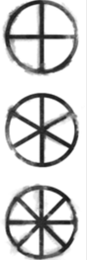

Correr ou lutar? Eis a questão. Quando você escolhe pela última, a cena vira combate. Durante o combate, todas as criaturas envolvidas estarão tentando causar dano o suficiente para vencer seu adversário, seja matando-o, fazendo-o se render ou fugir.

## Tokens

Você usará tokens durante o combate para manter o controle sobre certos recursos pertinentes. Separe moedas, fichas de poker, ou qualquer outro item de quantidade repetida para identificar cada tipo de token.

### Tokens de Ação

Separe uma pilha de tokens de ação para cada jogador, mínimo 3 para cada. Toda vez que um jogador realiza uma Ação, incluindo Habilidades, ele deve entregar um Token de Ação para o GM. Ao final do turno do GM, os tokens são devolvidos aos jogadores.

### Tokens de Terror

No início do turno do GM, ele pode converter 3 Tokens de Ação em 1 Token de Terror. Terror é equivalente a Stamina/Caos dos PCs. Gasto para realizar Habilidades especiais de NPCs - Para mais informações, veja [Terror]().

### Tokens de Reação

Toda criatura tem o direito ao mínimo de 1 Reação por rodada, podendo ter mais baseadas em certos fatores como progressão, habilidades ou outros efeitos. Mantenha um dado ou qualquer outro tipo de token que indique o uso e/ou disponibilidade de Reações.

### Tokens de Countdowns

Alguns efeitos terão efeitos duradouros. Para manter controle sobre o tempo restante, utilize tokens para ir diminuindo os valores. O token mais indicado para esse caso são dados - Para mais informações, veja [Countdowns](#countdowns).

## Tempo, Espaço & Alvos

### Mapa e Hex/Grids

Um combate em BTH é sempre realizado em um mapa representado o local da batalha, seja ele uma nave, um quarto ou qualquer outro. O mapa é dividido em Grids/Hexes e cada um deles representa algo em torno de 2m de tamanho.

### Tamanhos de Criaturas

Tamanho indica de forma genérica uma faixa de tamanho em que uma criatura se enquadra. O tamanho sempre é medido em sistema métrico. Esse indicador serve para ajudar na determinação de mecânicas como proteção, e indicar quantos Grids/Hexes a criatura ocupa em um mapa.

| Tamanho   | Tamanho Médio   | Tiles/Hexes |
| --------- | --------------- | ----------- |
| Minúsculo | Até 20cm        | 1           |
| Pequeno   | 21cm até 1,5m   | 1           |
| Médio     | 1,51m até 2,30m | 1           |
| Grande    | 2,31m até 4m    | 2x2         |
| Gigante   | 4,01m até 10m   | 3x3         |
| Colossal  | Acima de 10m    | 4x4 ou mais |

### Alcance & Distância

Alcances e Distâncias, quando curtas a moderadas, sempre serão indicadas em um valor de Grid/Hexes. Basta então multiplcar o valor por 2 para ter a medida em metros. Por exemplo, se uma arma tem alcance 10, quer dizer que ela consegue atingir alvos até 10 Grids/Hexes - ou 20m - de distância.

### Movimento

Qualquer movimento voluntário, acima de 2m, durante o turno de equipe, conta como uma Ação e 1 Token de Ação deve ser entregue ao GM. Para cada Ação de movimento, você pode mover-se até a distância indicada em seu personagem. Você tem a opção de se movimentar o dobro da distância realizando um check de Agilidade.

Qualquer movimento em Terreno Difícil, ou se arrastando, necessita de um check de Agilidade.

### Alvos

Certos Moves, como ataques, terão como requisito a escolha de um alvo. Um alvo pode ser único, múltiplos ou uma área. Um alvo é válido somente quando você tem linha de visão, alcance e bordas abertas entre você e ele. Exceções podem acontecer; estas estarão escritas explicitamente.

### Bordas e Linha de Visão

As bordas entre Grids/Hexes podem ser abertas ou bloqueadas (por uma parede, objeto ou até mesmo outra criatura). Portas, escotilhas e outras aberturas são consideradas bloqueadas quando fechadas, ou abertas quando - bem - abertas.  
Bordas abertas permitem movimento e linha de visão. Bordas bloquedas impedem linha de visão, a não ser que sejam transparentes (como vidros), ou caso você tenha sentidos que o permitam o contrário. Exceções podem acontecer; estas estarão escritas explicitamente.

### Modificadores do Mapa

**Terreno Difícil**  
Uma área estreita, apertada ou bagunçada/entulhada de objetos, pode dificultar o movimento. Sempre que você tentar se mover em uma área de terreno difícil, você precisa realizar um check de Agilidade. Em caso de falha você não sai do lugar. Exceções podem acontecer; estas estarão escritas explicitamente.

**Escuridão**  
A área que você se encontra possui baixa, ou nenhuma, luz. Prejudicando os checks de todos aqueles que possuem a Visão como sentido principal.

- Checks de Atenção, usando a visão como sentido, recebem uma penalidade de -2
- Moves contra alvos adjacentes recebem uma penalidade de -1 aos checks
- Moves contra alvos distantes recebem uma penalidade de -2 aos checks

Exceções podem acontecer; estas estarão escritas explicitamente.

### Tempo

O tempo de cada Move, assim como o de cada turno, varia. Cabe ao GM a decidir o tempo que se passa durante um combate. Apesar de cada um realizar seus Moves separados, e existirem turnos separados entre equipe e GM, toda uma rodada acontece ao mesmo tempo.

## Turnos

Um combate acontece em turnos, seguindo os passos descritos abaixo.

### Surpresa

Antes do início de um combate, basicamente ninguém possui conhecimento da presença de ninguém. Caso um dos lados (Equipe ou GM) ataque primeiro, surpreendendo o inimigo, um turno surpresa acontece.

**GM Surpreende Equipe**  
Caso os NPCs surpreendam a equipe de jogadores, todas as criaturas do GM estão ativas e ele pode executar seu turno. No momento que não houver mais criaturas ativas e/ou moves a serem executados, a equipe pode realizar seu turno e o combate segue normalmente.

**Equipe Surpreende GM**  
Caso os PCs surpreendam os NPCs, o primeiro turno é da equipe. Além disso, o primeiro Move de cada jogador é realizado com dificuldade Muito Fácil.

### Turdo da Equipe

Caso não haja surpresa por parte do GM, a equipe de jogadores executa seu turno.  
Considere os seguintes pontos durante o turno da Equipe de jogadores:

- Todos jogadores recuperam todas suas Reações.
- Todos os [Countdown de Turno]() presentes nos PCs diminuem em 1.
- Não há ordem de iniciativa, qualquer jogador pode executar Moves na ordem que quiser.
- Não há limites de [Moves]() que cada jogador pode executar antes de precisar passar sua "vez", jogadores podem realizar quantos e quaisquer Moves desejarem.
- Para cada Move que um jogador realizar durante este turno, 1 Token de Ação deve ser alcançado ao GM.
- NPCs podem realizar apenas [Reações](), estando ativos ou inativos.

Os resultados dos checks dos jogadores influenciam o decorrer do jogo:

**Sucesso ou Sucesso Crítico:** Turno de Equipe continua normalmente.  
**Sucesso Parcial:** GM pode jogar caso gaste 3 [Tokens de Ação](), caso contrário, Turno de Equipe continua normalmente.  
**Falha ou Falha Crítica:** GM pode jogar.

### Turdo do GM

Considere os seguintes pontos durante o turno do GM:

- Todos os NPCs recuperam todas suas Reações.
- Todos os [Countdown de Turno]() presentes nos NPCs diminuem em 1.
- GM pode **ativar** criaturas gastando Tokens de Ação. 1 Token de Ação = 1 Criatura ativa.
- O GM pode realizar 1 Move para cada criatura ativa, deixando-a então inativa. Exceções podem acontecer; estas estarão escritas explicitamente.
- PCs podem realizar apenas Reações.
- A vez passa para a equipe de jogadores assim que não houver mais criaturas ativas ou caso o GM queira passar antes.

### Resolução

O Combate segue o fluxo, intercalando entre turnos de equipe e GM, até um dos lados ser completamente eliminado, fugir, ou aceitar alguma negociação de paz ou rendição, ou qualquer outra interação em acordo entre o grupo.

<!-- ## Tipos de Combate

O combate acontece sempre em uma das duas formas: Corpo-a-Corpo (indicado como Adjacente) ou à Distância.

### Ajdacente ou Corpo-a-corpo

### À Distância -->

## Countdowns

Algumas mecânicas podem querer introduzir um **countdown**. Cowntdowns são uma maneira dos jogadores e GM acompanharem o andamento de um evento ou efeito. Podem ser representados de duas formas: um dado ou um relógio de progresso dividido em partes (veja exemplo abaixo). Podem representar qualquer forma de tempo: turno, minutos, horas, dias, semanas, etc.

O GM ou a própria regra define um valor do countdown, este que será representado por um dado do mesmo valor ou um relógio com divisões. Por exemplo, para um countdown 4 será usado um dado no valor 4 ou um relógio com 4 partes.

Countdowns andam apenas para frente, nunca para trás, ou seja, cada vez que um gatilho acontence, você diminui em 1 o valor do dado ou preenche uma parte do relógio.

Quando o countdown chega a 0 ou a ultima parte do relógio é marcada, o evento acontece ou o efeito acaba.

### Countdown Turno

Alguns efeitos, como **condições**, têm valores fixos atrelados (exemplo Debilitado 2). Nesse tipo de countdown, o evento segue sempre que o turno do lado afetado começa. Por exemplo, se uma criatura do GM aplica a condição Debilitado 2 em seu personagem, o countdown diminui em 1 sempre que o turno de equipe começa.

### Countdown Dinâmico

Nem todos countdowns terão o começo de turno como gatilho para diminuir seu valor. Pode haver eventos maiores e difíceis de medir em uma medida de tempo, como por exemplo: "término da construção de uma bomba". O GM pode decidir que este countdown baixa por diversos motivos: Sempre que um jogador falhar criticamente, sempre que os jogadores fazerem um descanso, etc. O GM não necessariamente precisa dizer para os jogadores quando o countdown irá diminuir, mas sempre precisa mostrar quando acontecer, para eles terem uma ideia. Algumas habilidades também poderão ter countdowns baseados em outros fatores, como por exemplo, baixar sempre que você ou uma criatura do GM realizar um Move.

