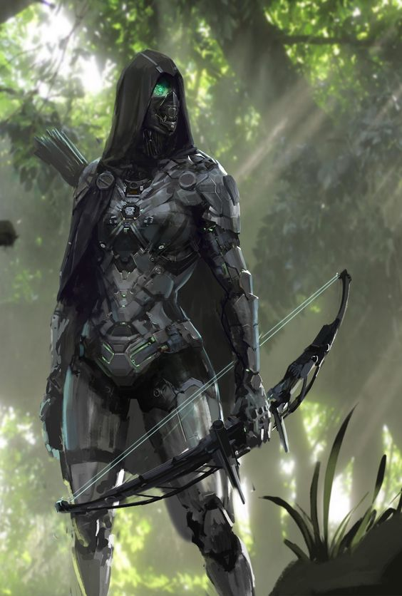
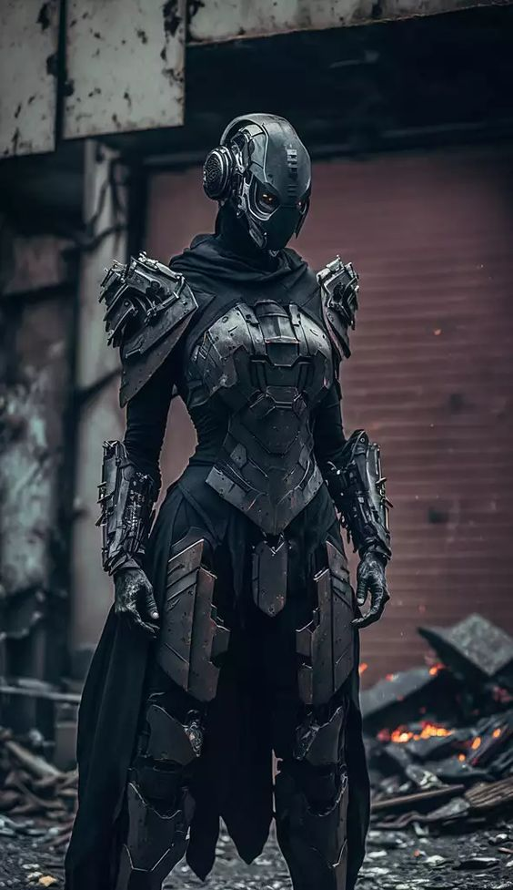
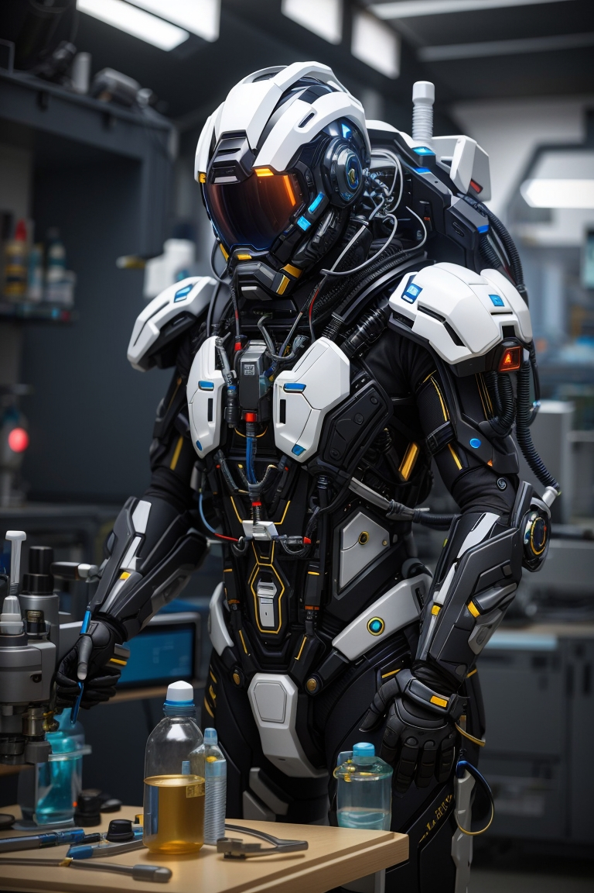
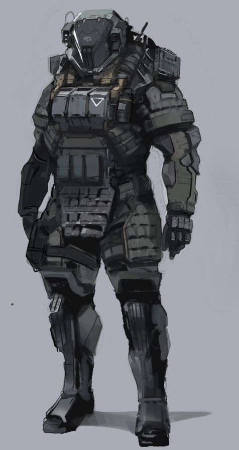
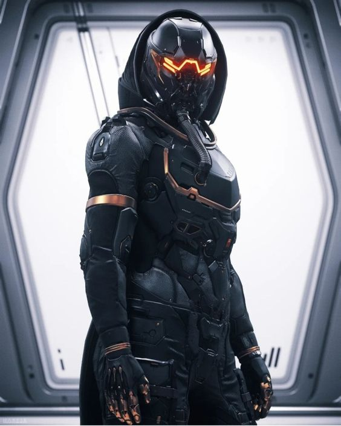
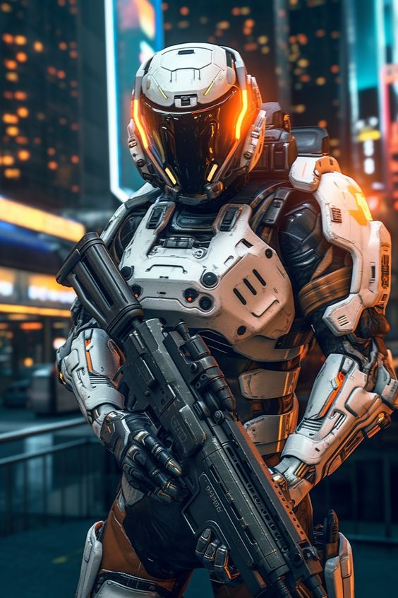

## Humanos

- **Tamanho:** Médio
- **Movimento:** Terrestre e Aquático - Perto
- **Conhecimento:** Base em todas as áreas da ciência

## Caminhos

### Batedor

{ width="200", align="right" }

- **Limites de Dano:** 2 | 4 | 6
- **Feridas:** 5
- **Stress:** 5
- **Caos:** 2
- **Armas:** Arco-Caos, Lâmina Fragmento
- **Armadura:** A.N.E. Leve
- **Equipamentos:** 1x Armadilha, 1x Kit Médico Simples
- **Habilidades:** Golpe Certeiro
- **Aprimoramentos:** A.N.E., Arco-Caos e Lâmina Fragmento
- **Atributos Recomendados:** Agilidade e Controle

### Capitão

{ width="200", align="right" }

- **Limites de Dano:** 2 | 4 | 6
- **Feridas:** 5
- **Stress:** 6
- **Caos:** 3
- **Armas:** Pistola
- **Armadura:** A.N.E. Leve
- **Equipamentos:** Neurohancer, 1x Kit Médico Simples
- **Habilidades:** Raciocínio Rápido
- **Aprimoramentos:** A.N.E. e Neurohancer
- **Atributos Recomendados:** Atenção e Cérebro

### Cientista

{ width="200", align="right" }

- **Limites de Dano:** 2 | 4 | 6
- **Feridas:** 5
- **Stress:** 5
- **Caos:** 3
- **Conhecimento:** Perícia em Biologia ou Química
- **Armas:** Multigun
- **Armadura:** A.N.E. Leve ou Média
- **Equipamentos:** 3x Compostos Químicos Simples, 1x Kit Médico Simples
- **Habilidades:** Scan - Orgânicos
- **Aprimoramentos:** A.N.E. e Multigun
- **Atributos Recomendados:** Controle e Cérebro

### Engenheiro

{ width="185", align="right" }

- **Limites de Dano:** 2 | 4 | 6
- **Feridas:** 5
- **Stress:** 5
- **Caos:** 3
- **Conhecimento:** Perícia em Engenharia
- **Armas:** Coilgun
- **Armadura:** A.N.E. Leve ou Média
- **Equipamentos:** Drone Forja, 1x Kit Médico Simples
- **Habilidades:** Scan - Construtos
- **Aprimoramentos:** A.N.E., Coilgun e Drone Forja
- **Atributos Recomendados:** Controle e Cérebro

### Piloto

{ width="210", align="right" }

- **Limites de Dano:** 2 | 4 | 6
- **Feridas:** 5
- **Stress:** 6
- **Caos:** 2
- **Armas:** Pistola Cinética
- **Armadura:** A.N.E. Leve
- **Equipamentos:** Hoverboard, 1x Kit Médico Simples
- **Aprimoramentos:** A.N.E., Pistola Cinética e Hoverboard
- **Atributos Recomendados:** Controle e Atenção

### Soldado

{ width="200", align="right" }

- **Limites de Dano:** 2 | 4 | 6
- **Feridas:** 5
- **Stress:** 5
- **Caos:** 2
- **Armas:** Omnigun
- **Armadura:** A.N.E. Leve ou Média
- **Equipamentos:** 1x Granada, 1x Kit Médico Simples
- **Habilidades:** Arsenal
- **Aprimoramentos:** A.N.E. e Omnigun
- **Atributos Recomendados:** Controle

