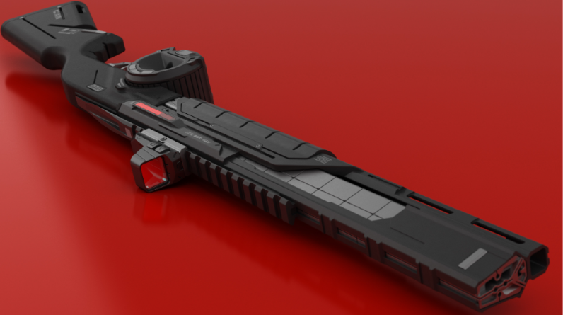
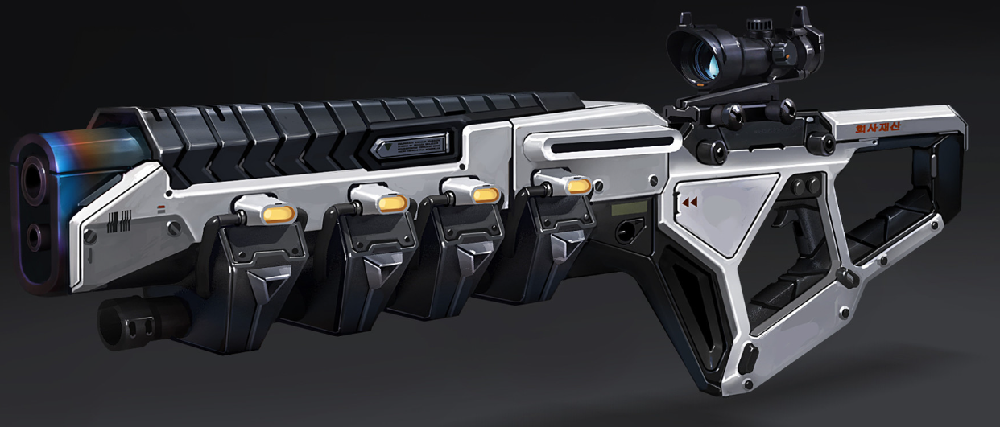
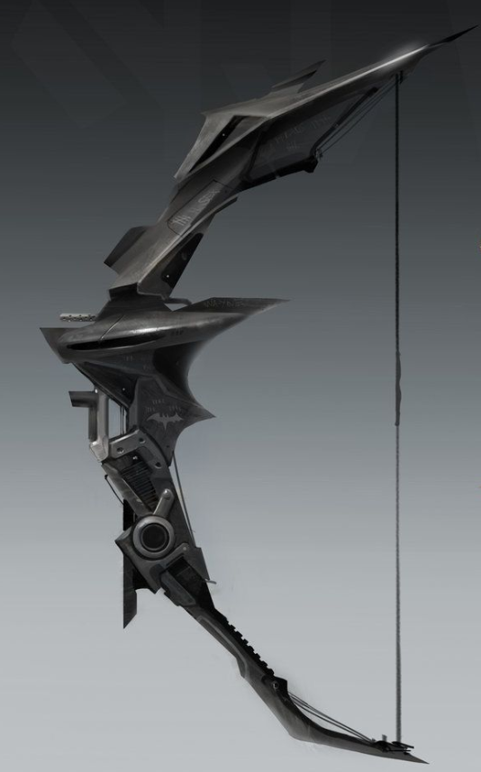

| Nome (Mãos)          | Atributo e Alcance    | Dano               | Propriedades              | Ações                  |
| -------------------- | --------------------- | ------------------ | ------------------------- | ---------------------- |
| Arco-Caos (2)        | Controle - Longe      | Físico             | Silenciosa                | Retração, Montagem     |
| Coilgun (2)          | Controle - Perto      | Energia (Elétrico) | Recarregar                | Carregar               |
| Lâmina Fragmento (1) | Agilidade - Adjacente | Físico             | Rápida, Segura, Sileciosa | Retração, Montagem     |
| Lâmina Montada       | Agilidade - Adjacente | Físico             |                           |                        |
| Multigun (2)         | Controle - Perto      | Físico             | Recarregar                | Crafting, Lançar Dardo |
| Omnigun (2)          | Controle - Variado    | Físico             | Recarregar                | Modo                   |
| Pistola Cinética (1) | Controle - Perto      | Físico             | Recarregar                | Modo                   |
| Rifle Montado        | Controle - Longe      | Energia (Elétrico) |                           |                        |

{ width="300" }
{ width="400" }

<figure markdown="span">
  { width="200" }
</figure>