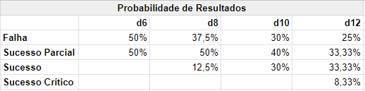
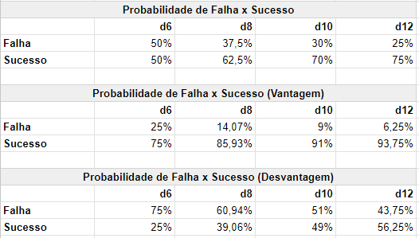

Aqui você encontra maiores informações sobre o impacto de aumentar o tamanho de um dado ou abrir um portão do caos de um atributo.

## Aumentar Dado
Aumentar dado implica em você passar o dado do atributo para o próximo nível, por exemplo, se seu atributo tiver d4, você passa para d6, se tiver d6, você passa para d8 e assim por diante. Os possíveis valores estão abaixo:

d4 -> d6 -> d8 -> d10 -> d12 -> d20

### Impacto
Aumentar o tamanho de um dado impacta:

- Maiores chances de sucesso e possibilidade de conseguir graus de sucesso maiores. Veja [aqui](../3_game/checks.md#resultados).
- Maiores chances de vencer [disputas](../3_game/checks.md#disputa). 
    - Como disputas são decididas pelo grau de sucesso, quanto maior sua possibilidade de grau de sucesso melhores, maior a chance de vencer a disputa.
    - Ao mesmo tempo, caso haja empate no grau de sucesso em disputas, o valor do dado é levado em consideração, portanto quanto maior o valor, mais chances de vencer a disputa.

Caso você queira informações mais precisas e detalhadas, veja [Estatísticas](#estatísticas).

## Abrir Portão do Caos
Abrir um Portão do Caos impacta em seu personagem estar mais próximo do Caos e também, maior assimilação quanto a seus poderes. Quando você abre um portão do caos, você deve:

- Separar um dado extra de cor diferente do dado principal e com o mesmo tamanho. Este será seu <ins>dado caótico</ins> e você irá rolá-lo sempre que precisar rolar seu dado principal.
- Modificar as características influenciadas pelo portão do caos do atributo. Como por exemplo, para cada portão do caos aberto no atributo Físico, você ganha um ponto de Ferida permanentemente.

### Impacto
Mas afinal de contas, que impacto mecânico abrir um portão do caos lhe traz?

- Sobrevivência e poder: O fato de você aumentar recursos ou ter acesso a novas opções quando você abre um portão do caos, lhe garante maiores chances de sobrevivência ou maior poder.
- Falha Crítica: Nem tudo é bom quando você introduz dados caóticos. Ao rolar dados caóticos você tem a possibilidade de rolar Falha Crítica. Mas nem tudo está perdido, quando você falha criticamente, sua equipe recebe [Karma](../3_game/resources.md#karma).
- Sucesso Crítico: A introdução de dados caóticos também lhe dá a chance de conseguir Sucesso Crítico mesmo que seu dado não tenha esse grau de sucesso.
- Maiores chances de vencer [disputas](../3_game/checks.md#disputa) uma vez que os valores dos dados caóticos são somados ao valor de comparação.
- Você causa maior dano uma vez que os valores dos dados caóticos são somados ao dano de seus ataques.

## Estatísticas
Abaixo você encontra diversas estatísticas para aqueles que gostam de tomar as melhores decisões possíveis.

#### Chances para cada grau de resolução
Desconsiderando dados caóticos.

#### Chances de falha x sucesso
Desconsiderando dados caóticos.

#### Chances de sucesso crítico com dados caóticos
A última coluna e a soma das chances eu não tenho certeza quanto ao resultado.

#### Média de dano adicional com dados caóticos

