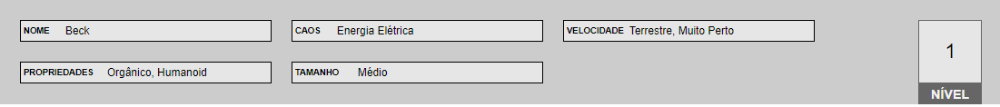
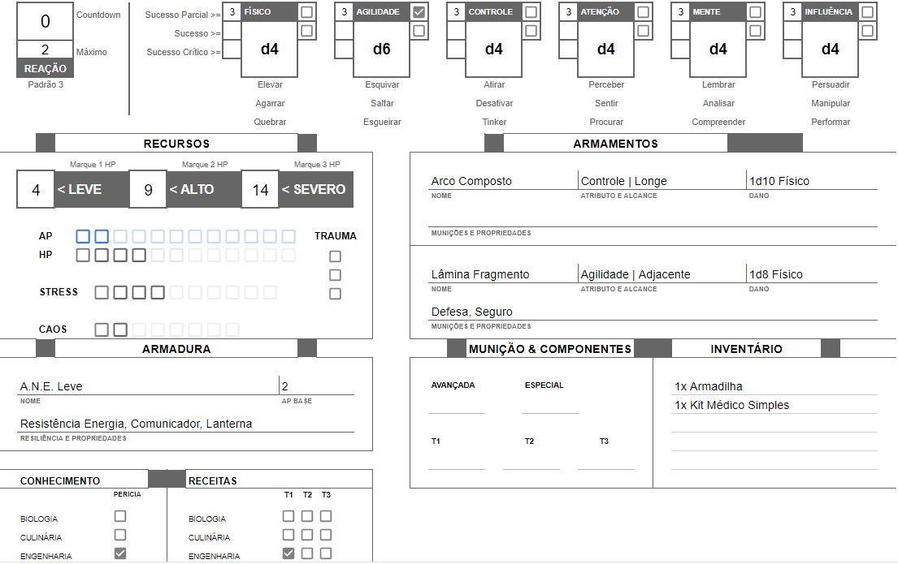
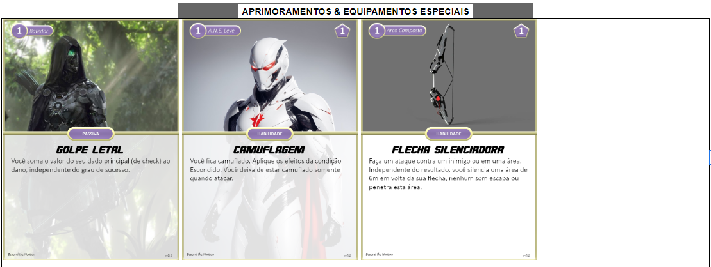

Segue abaixo um exemplo de criação de personagem da espécie Humano. Como alguns detalhes mudam entre espécies, os passos podem e irão variar dependendo a espécie escolhida. Os passos exclusivos dos humanos terão (Humano) ao final, qualquer outro passo sem prefixo é de uso geral.

<!-- ### Passo 1: Escolha sua Espécie

Nosso jogador escolhido, vamos chamá-lo de Remella, decidiu escolher a espécie Humano. Uma vez feita a escolha, Remella anota os seguintes itens abaixo, de acordo com as informações encontradas no módulo dos Humanos:

**Nível:** 1  
**Reação:** 3  
**Propriedades:** Orgânico, Humanoid  
**Tamanho:** Médio  
**Movimento:** Terrestre, Muito Perto   

Remella já decide nomear seu personagem **Beck**.

### Passo 2: Escolha sua Classe (Humano)

O primeiro passo na criação de um personagem humano é a escolha de classe, essa que representa uma ideia geral do papel do seu personagem na comunidade. Humanos possuem atualmente as classes de Agente, Segurança e Técnico. Remella gosta mais da ideia de um personagem ofensivo e voltado totalmente ao combate, portanto ele escolhe a classe [Segurança](../../2_human/classes/security/index.md).

A classe define de maneira narrativa seu papel quanto a uma equipe e, de maneira mecânica, seus **Limites de Dano**, **Ferida**, **Stress** e **Caos**. Remella toma nota dos valores concedidos em sua ficha de personagem:

**Limites de Dano:** 4 <- 9 <- 14  
**Feridas:** 4  
**Stress:** 4  
**Caos:** 2  

Ignore o AP por enquanto, uma vez que ele é preenchido quando você receber sua Armadura.

### Passo 3: Escolha sua Especialização (Humano)

Cada classe de humanos possui no mínimo duas especializações, estas que definem mais ainda seu papel quanto a uma equipe. A classe de Segurança possui três especializações: Batedor, Brutamonte e Soldado. Remella se intereça pelo [Batedor](../../2_human/classes/security/scout.md), uma vez que parece satisfazer uma temática de assassino silencioso e faz uso de um arco composto e uma lâmina fragmento.

A especialização define mecanicamente seu **Conhecimento Científico**, **Receitas**, **Armamentos**, **Armaduras**, **Equipamentos** e **Aprimoramentos**.

A especialização de Batedor diz a Remella para realizar o seguinte:

**Armamentos Principais:** Arco Composto, Lâmina Fragmento       
**Armadura:** A.N.E. Leve     
**Equipamentos:** 1x Armadilha  (escolha na hora do uso), 1x Kit Médico Simples  
**Cartas:** Golpe Letal      
**Cartas de Aprimoramentos:** Separe as cartas de aprimoramentos para A.N.E., Arco Composto e Lâmina Fragmento    

Neste passo aqui, como recebemos a armadura, nós marcamos o AP que foi mostrado na imagem do passo 2.

#### Carta Recebida: Golpe Letal

{ width="280" }

#### Cartas de Aprimoramentos para escolha no passo 5

{ width="280" }
{ width="280"}

{ width="280"}
{ width="280"}

#### Passo 3.1: Decida seu Conhecimento Científico (Humano - Batedor)

A especialização de Batedor diz que você deve escolher seu Conhecimento Científico. Para isto, Remella deve escolher entre uma das áreas da ciência: Biologia, Culinária, Engenharia, Física e Química. Remella deseja ser capaz de destrancar portas, desarmar dispositivos mecânicos ou digitais, portanto decide escolher a área de **Engenharia**.

1. Remella anota que possuí perícia em Engenharia.
2. Remella toma nota que sabe produzir receitas de engenharia do nível T1.

### Passo 4: Avance Atributos

Neste passo Remella deve escolher atributos para avançar, ou seja, melhorar. Lembrando que neste passo você:

1. Você pode aumentar o tamanho do dado ou abrir um portão do caos de um atributo.
      1. Todas as espécies começam com d6 em todos os atributos, aumentar o tamanho de um dado seria aumentar o d6 para um d8, um d8 para um d10 e assim por diante.
      2. Caso você abra um portão do caos:  
            1. Separe um dado extra de cor diferente do dado principal e com o mesmo tamanho. Este será seu <ins>dado caótico</ins> e você irá rolá-lo sempre que precisar rolar seu dado principal.  
            2. Modifique as características influenciadas pelo portão do caos do atributo. Como por exemplo, para cada portão do caos aberto no atributo Físico, você ganha um ponto de Ferida permanentemente.
2. Faça novamente o passo 1.
3. Tome nota dos valores de <ins>Sucesso Parcial</ins>, <ins>Sucesso</ins> e <ins>Sucesso Crítico</ins> para facilitar a resolução de um check.

Remella gosta da ideia de ser um assassino que suja as mãos, que mata seus inimigos de forma próxima e pessoal, olhando em seus olhos enquanto estes perdem o brilho...Por isso Remella decide avançar seus atributos de forma que aprimore seu uso com a lâmina fragmento, esta que usa o atributo de Agilidade.

1. Remella aumenta o tamanho do seu dado de Agilidade, podendo usar um d6 agora.
2. Remella decide abrir um portão do caos no atributo de Agilidade também.
   1. Remella possui agora um dado caótico em Agilidade. Em resumo, sempre que for necessário rolar um check de Agilidade, Remella deve rolar 2d6, sendo um dos dados o principal e o outro caótico.
   2. Como foi aberto um portão de caos em Agilidade, Remella diminui em 1 seu countdown de reação.
3. Remella também toma nota dos valores de Sucesso Parcial, Sucesso e Sucesso Crítico para facilitar a resolução de um check.

## Passo 5: Escolha Aprimoramentos
Quando Remella selecionou a especialização de Batedor, ele automaticamente recebeu o aprimoramento Golpe Letal e uma lista de outras cartas de aprimoramento. Esta lista consiste em cartas de aprimoramentos para sua armadura: A.N.E. Leve, e para seus armamentos: Arco Composto e Lâmina Fragmento, todos para seu nível atual, que é 1.

Ao total, Remella possui quatro cartas de aprimoramentos, duas para sua armadura e uma para cada armamento. A espécie de humanos diz que apenas duas devem ser selecionadas por nível.

Como Remella quer ser um assassino silencioso, ele escolhe as seguintes cartas de aprimoramento:

{ width="280" }
{ width="280"}

## The End

Pronto, Remella acaba de criar seu primeiro personagem em Beyond the Horizon e está pronto para iniciar sua aventura. Abaixo você encontra uma visão geral de como ficou sua ficha por completo.

 -->
