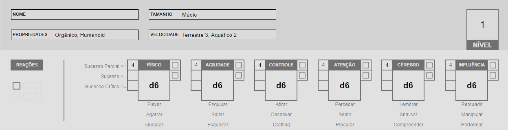

Segue abaixo um exemplo de criação de personagem. 

## Passo 1: Escolha sua Espécie

Olhando todas as espécies disponíveis no momento, Remella decide seguir o padrão e fazer um Humano. Os passos para criar um Humano podem ser vistos [aqui](../../2_galactic_force/creation.md).

Remella **anota** em sua ficha o seguinte:

### Características

1. **Nível** 1.
2. **Reações:** 1.
3. **Atributos:** d6 em todos.
4. **Propriedades:** Orgânico, Humanoid.
5. **Tamanho:** Médio.
6. **Movimento:**. Terrestre 3, Aquático 2.
7. **Conhecimento Científico:** Todas as áreas.

### Recursos

1. **Limites de dano:** 2 - 5 - 8  
2. **Feridas:** 5
3. **Stress:** 5
4. **Caos:** 2

  
_Aqui você pode ver 2 AP marcado, ele fará sentido somente no passo 3, quando você escolhe sua armadura._

### Cartas de Espécie

Ao escolher um Humano, Remella pode **escolher** uma carta de espécie que representa sua classe: Batedor, Capitão, Cientista, Engenheiro, etc. Remella gosta da ideia do Batedor:

{ width="280" }

Uma vez escolhida a carta, Remella deve **aplicar** suas instruções, no caso ele **anota** em sua ficha:

## Passo 2: Escolha suas Armas

Lendo a passiva presente na carta do Batedor, Remella percebe que ela funciona com armas que possuem a propriedade Silenciosa. Olhando a lista de armas a escolher, Remella **escolhe** o Arco Composto. Uma vez escolhido sua segunda arma, Remella pode escolher entre uma Pistola ou Faca de Combate. Como seu personagem já possui uma arma corpo-a-corpo boa, Remella decide escolher uma Pistola. Remella **anota** suas armas.

## Passo 3: Escolha suas Armaduras

Olhando a lista de armaduras disponíveis para seu personagem, e suas respectivas habilidades, Remella percebe que a A.N.E. Leve pode usar a habilidade Camuflagem. Remella curte a ideia de ser um assassino silencioso que surpreende seus inimigos. Remella **escolhe** A.N.E. Leve e **anota** em sua ficha, juntamente com o AP provido por ela.

## Passo 4: Escolha seus Equipamentos

Neste passo Humanos **recebem** 1x Kit Médico Simples e Provisões, Remella **anota** em sua ficha, juntamente com a Armadilha que recebeu ao escolher sua carta Batedor.

## Passo 5: Escolha seu Conhecimento Científico

Como um Batedor e assassino silencioso, Remella gosta da ideia de boter destrancar travas eletrônicas, desativar dispositivos ou desarmar armadilhas, por isso ele **escolhe** Engenharia como área da ciência para adquirir Perícia. Remella **anota** essa informação em sua ficha, juntamente com sua capacadidade de Crafting de receitas de Engenharia T1.

## Passo 6: Avance Atributos

Remella olha pra sua ficha e entende que os Atributos mais utilizados por seu personagem serão Agilidade e Controle, afinal de contas são os atributos usados ao atacar com suas armas. Remella **anota** o avanço destes atributos em sua ficha, juntamente com seus graus de sucesso.

## Passo 7: Escolha Aprimoramentos

Remella **separa** todas as cartas de aprimoramentos nível 1 disponíveis para o personagem que construiu, sendo:

- 2 da A.N.E. Leve (Visão Aprimorada e Camuflagem)
- 1 da Lâmina Fragmento (Broca)
- 1 do Arco Composto (Flecha Silenciadora)

{ width="280" }
{ width="280" }

{ width="280" }
{ width="280" }

Remella possui 4 cartas mas pode escolher apenas 2. Uma das razões de ter escolhido A.N.E. Leve no passo 3 era justamente a possibilidade de usar Camuflagem, Remella **escolhe** esta carta. Remella também acha interessante a carta Broca, que permite deixar um inimigo sangrando e morrendo enquanto ele pode lidar com outro, Remella **escolhe** esta carta também.

## Passo 8: Finalização

Remella quer sair jogando logo e não pensa muito em detalhes do seu personagem, apenas seu nome: Beck.

## Ficha de Personagem

Você pode acessar esse [link](https://docs.google.com/spreadsheets/d/19w17pxwF-46oYBTceI109gJkN0Po3Q7_iUlrXDpy-CM/edit#gid=1720517164){:target="_blank"} para visualizar como ficou a ficha final do personagem de Remella, Beck.