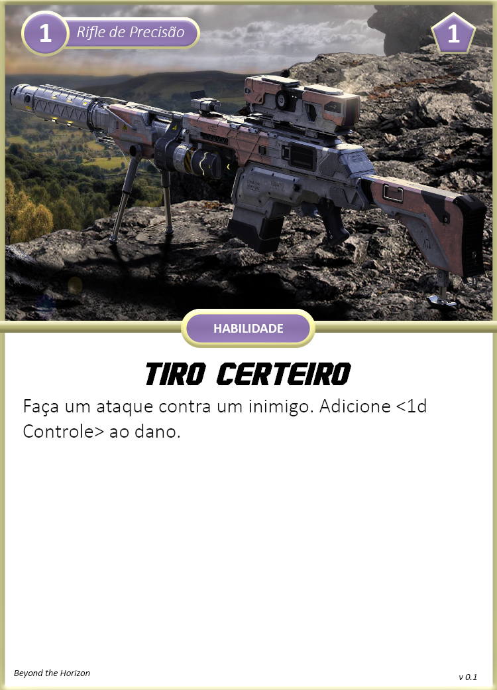

<!-- Neste capítulo você encontra informações sobre como criar um personagem, tais como detalhes de espécies e outros. -->

# Criação de Personagem

A primeira coisa que você deve fazer, caso não seja o GM, para começar a jogar Beyond the Horizon, é criar um personagem. O passo 1 será a escolha da espécie e esta deve ser a primeira a ser feita, uma vez que modifica bastante como seu personagem será construído. Os passos a seguir, depois de escolher a espécie, estão informados em uma ordem para melhor organização, porém a criação de personagem é fluída, você pode voltar e fazer qualquer passo na ordem que desejar, inclusive trocar de espécie.

## Passo 0: Características Gerais

Neste passo você irá anotar características que independem de espécie, sendo padrão para todos no início.

1. **Nível:** Você normalmente começa nível 1, mas seu grupo pode decidir por começar aventuras em maiores níveis.
2. **Reação:** Indica o [Countdown](../3_game/countdown.md) de reação, começando sempre em 3.

## Passo 1: Escolha sua Espécie

Escolha a espécie que você deseja jogar. Cada espécie possuíra seu livro/módulo separado, após escolhe-la, pegue o módulo dela e separe-o para o passo 2. **Por enquanto, neste beta, temos apenas os Humanos como espécie disponível.**

Neste passo você tomará notas dos seguintes itens da sua ficha:

1. **Propriedades:** Indica as [Propriedades](../3_game/properties.md) da sua espécie.
2. **Tamanho:** Indica o [Tamanho](../3_game/distance.md#tamanho) da sua espécie: Minúsculo, Pequeno, Médio, Grande ou Gigante.  
3. **Movimento:** Indica o [Movimento](../3_game/distance.md#movimento) da sua espécie. Geralmente sendo Terrestre, Muito Perto.

Estes são os itens que você sempre tomará nota quando escolher uma espécie, porém algumas já podem fazê-lo anotar outras coisas como [Resiliência](../3_game/damage.md#resiliência).

### Espécies

| Espécie  | Classificação             | Características de Destaque     |
| -------- | ------------------------- | ------------------------------- |
| Humano   | Orgânico, Humanoid        | A.N.E., Classes e Equipamentos  |
| Hiver    | Orgânico, Humanoid        | Simbiose, Casta                 |
| Evoras   | Orgânico, Inseto          | Evolução, Adaptação             |
| Symbion  | Orgânico, Planta (Fungus) | Simbiose, Arquétipos e Evolução |
| Realshir | Elemental                 | Reinos e Elementos              |
| Kitsuzen | Orgãnico, Besta (Raposa)  | Ligação de alma                 |

#### Humano

Humanos em BTH possuem a mesma aparência humanoid diversa dos humanos presentes na Terra hoje. Fazendo uso de tecnologias avançadas e de toda sua versatilidade, humanos se expandiram a diversos cantos do universo, terraformando os planetas conquistados ou vivendo em estações espaciais. Sua ambição e extremo desejo de aventura motivam sua exploração e expansão espacial. Humanos utilizam equipamentos de alta tecnologia como sua Armadura Nano Evolutiva (A.N.E.) e armas de fogo para suprir suas habilidades.

#### Hiver

Hivers são humanos que decidiram migrar para outros cantos do universo após decidirem que terraformar um planeta é uma atrocidade quanto a fauna e flora nativa. Com o lema de "Não adapte o meio a você, adapte-se ao meio", hivers buscam a simbiose com as mais diversas criaturas parasíticas, garantido-os alta modificação e adaptação corporal. Exploram o universo sempre buscando novas formas de vida que possam ter uma relação de benefício mútuo. Os simbiontes presentes no corpo de um hiver proveem diversos benefícios e habilidades a seu hospedeiro.

#### Evoras

Uma espécie insectóide que possui anatomia semelhante a insetos, aranhas, e outros diversas criaturas presentes na Terra. São seres racionais e extremamente vorazes e predadores. Geralmente vagam pelo universo sozinhos, caçando as mais diversas criaturas para acelerar seu processo evolutivo. Evoras atacam suas vítimas com mandíbulas, braços e ferrões que lembram outras criaturas do planeta Terra. Também podem lançar substâncias especiais como seda (teia), asfalto, entre outras, para sucumbir suas vítimas.

#### Symbion

Uma espécie de fungos parasíticos que se especializou em simbiose e adaptação, tanto que ao longo do tempo, ao infectar outras criaturas racionais, também alcançou senciência e racionalidade. Se espalha pelo universo ao contaminar criaturas através da dispersão de esporos por seres já infectados. Symbions se adaptam a criatura infectada, tornando-a mais forte e aprimorando suas habilidades. Dependendo do Symbion, também pode infectar criaturas já mortas ou à beira da morte e usá-las como se fossem zumbis por um período de tempo

#### Realshir

Um dos seres mais raros do universo, não se possui muita informação sobre sua anatomia, biologia, função e procriação. Realshirs são eres elementais, ou seja, compostos inteiramente por um elemento atribuído ao portão do Reino que surgiu. Há relatos de realshirs que podem fazer transições entre mais de um elemento, podendo ter conexão com o Reino do Fogo num instante, e no outro ao Reino do Ar ou Tempestade. Parecem viajar pelo universo em uma espécie de migração solitária procurando Portões de Reinos em diferentes mundos para dominar os elementos. Utilizam seu próprio corpo elemental para realizar suas habilidades e movimentação.

## Passo 2: Siga os passos da espécie escolhida

Cada espécie possui suas peculiaridades, como por exemplo os Humanos possuem Classes e Especializações, enquanto os Realshirs possuem Reinos, e assim vai. Por isso os passos de criação de personagem de uma espécie para outra irão variar e estarão descritas em cada módulo separadamente.

As espécies geralmente irão determinar as seguintes características de seu personagem:

1. **Características Específicas:** Aqui você anotará características específicas de espécie, como por exemplo Classe, Especialização, Reinos, etc.
2. **Limites de Dano:** [Limites de dano](../3_game/resources.md#armor-points-hit-points--limites-de-dano) aparecem em três níveis diferentes: Leve, Alto, Severo.
3. **Feridas e Stress Inicial:** Suas [Feridas](../3_game/resources.md#armor-points-ap-feridas--limites-de-dano) e [Stress inicial](../3_game/resources.md#stress), indicando quanto dano seu personagem pode suportar.
4. **Caos:** Quantidade de [Caos](../3_game/resources.md#caos) que você irá começar. Caos é utilizado para alimentar suas [Habilidades](#habilidade).
5. **Conhecimento Científico e Receitas:** Áreas da ciência que você possui conhecimento e receitas dos projetos que você poderá criar. Útil para certas [Ações](../3_game/actions.md#ações-com-ciência) e [Crafting](../3_game/crafting.md).
6. **Armamentos:** [Armamentos](../3_game/weapon_armor.md#armamentos) que você poderá usar.
7. **Armaduras:** [Armaduras](../3_game/weapon_armor.md#armaduras) que você poderá usar.
8. **Equipamentos:** [Equipamentos](../3_game/inventory.md#equipamentos-e-inventário), ferramentas caso sua espécie faça uso. Você também pode possuir equipamentos especiais que aparecem em forma de carta.
9. **Aprimoramentos:** Cartas de aprimoramentos que você irá possuir ou escolherá futuramente no [passo Y](#passo-y-receba-e-escolha-aprimoramentos).
10. **Companions:** Aliados que são seu companions, como um drone ou um cachorro (veja [Companion](../3_game/companion.md)).
11. **Transporte:** Veículos que você poderá pilotar ou criaturas que poderá montar (veja [Transporte](../3_game/transport.md)).

## Passo X: Avance Atributos

Neste passo você escolherá um ou dois atributos para avançar, estes que refletem o quão treinado ou habilidoso seu personagem é em uma das seis características principais: Físico, Agilidade, Controle, Atenção, Cérebro e Influência. Neste passo:

1. Você pode aumentar o tamanho do dado ou abrir um portão do caos de um atributo.
      1. Todas as espécies começam com d4 em todos os atributos, aumentar o tamanho de um dado seria aumentar o d4 para um d6, um d6 para um d8 e assim por diante.
      2. Caso você abra um portão do caos:  
            1. Separe um dado extra de cor diferente do dado principal e com o mesmo tamanho. Este será seu <ins>dado caótico</ins> e você irá rolá-lo sempre que precisar rolar seu dado principal.  
            2. Modifique as características influenciadas pelo portão do caos do atributo. Como por exemplo, para cada portão do caos aberto no atributo Físico, você ganha um ponto de Ferida permanentemente.
2. Faça novamente o passo 1.
3. Tome nota dos valores de <ins>Sucesso Parcial</ins>, <ins>Sucesso</ins> e <ins>Sucesso Crítico</ins> para facilitar a resolução de um check.

Para ajudar na decisão entre aumentar o tamanho do dado ou abrir portão do caos, veja os impactos de cada um nesta [página](./advance.md).

### Atributos

Abaixo você encontra a lista dos atributos principais do seu personagem, assim como uma breve explicação do que eles representam, exemplos de cenários onde eles serão aplicados e também o que ocorre quando você abre um portão do caos para eles. Ao lado do nome de cada um segue exemplos de ações que seu personagem pode executar, sendo elas apenas inspirações, não se limite a elas. O uso de atributos para ações é dinâmico e depende do contexto, exemplos:

_Quer intimidar uma criatura com ameaças verbais? Use Influência.  
Quer intimidar a criatura quebrando algum objeto e ameaçando apenas com sua presença? Use Físico._ 

_Quer desativar um dipositivo digital tentando hack? Use Cérebro.   
Quer desativar um dispositivo digital abrindo-o e mexendo em seus componentes? Use Controle._  

#### Físico: Elevar, Agarrar, Quebrar

Físico indica o quão forte você é, sua força física e sua fortitude do corpo, quanta punição física pode suportar. Você irá realizar checks de Físico para atacar com armas pesadas, quebrar uma porta, levantar objetos ou criaturas, ou prender alguém.  
**Portão do Caos:** Para cada portão do caos aberto neste atributo, aumente um ponto em Ferida permanentemente.

#### Agilidade: Esquivar, Saltar, Esgueirar

Agilidade indica o quão rápido você é, sua mobilidade em terrenos difíceis, reflexos e velocidade de reação a perigos. Também indica o quão bom você é ao se esgueirar e esconder. Você irá realizar checks de Agilidade para atacar com armas leves, subir uma corda, saltar entre telhados, fugir das garras de inimigos, esgueirar ou se esconder de inimigos, ou esquivar de um ataque.  
**Portão do Caos:** Para cada portão do caos aberto neste atributo, diminua em um seu **countdown de reação**.

#### Controle: Atirar, Desativar, Tinker

Controle indica o quão hábil e preciso você é. Você irá realizar checks de Controle para tarefas que necessitam de um bom controle motor do corpo, como ser preciso ao atacar com armamentos de alcance alto, cuidadoso e habilidoso ao usar ferramentas, ou mexer em dispositivos mecânicos ou digitais.  
<!-- TODO: definir bonus portão -->
<!-- **Portão do Caos:** Para cada portão do caos aberto neste atributo, diminua em um seu **countdown de reação**. -->

#### Atenção: Perceber, Sentir, Procurar

Atenção indica o quão você é atento a detalhes ao seu redor. Você irá realizar checks de Atenção para perceber perigos, procurar e notar detalhes no ambiente ao seu redor, notar se alguma criatura está tentando lhe manipular, ou rastrear uma criatura ou objeto.
<!-- TODO: definir bonus portão -->
<!-- **Portão do Caos:** Para cada portão do caos aberto neste atributo, diminua em um seu **countdown de reação**. -->

#### Cérebro: Lembrar, Analisar, Compreender

Cérebro indica o quão bom você é ao deduzir e inferir informações para resolução de problemas complexos, seu conhecimento e memória e sua calma perante momentos estressantes. Você irá realizar checks de Cérebro para interpretar fatos, resolver problemas complexos, enxergar padrões, ou relembrar informações importantes.  
**Portão do Caos:** Ao abrir seu primeiro portão do caos neste atributo, você pode fazer [Crafting](../3_game/crafting.md) de receitas T2, ao abrir o segundo portão você pode fazer crafting de receitas T3.

#### Influência: Persuardir, Manipular, Performar

Influência indica o quão influente você é socialmente, sua força de personalidade, sua presença quanto a perigo e outras situações. Você irá realizar checks de Influência para persuardir, enganar, intimidar ou manipular uma criatura.
**Portão do Caos:** Para cada portão do caos aberto neste atributo, aumente um ponto em Stress permanentemente.

## Passo Y: Escolha Aprimoramentos

Neste passo você irá escolher aprimoramentos de uma lista que você recebeu nos passos anteriores, você geralmente irá escolher dois, porém o número pode varia entre espécies. Você escolherá aprimoramentos novos cada vez que você sobe de nível, podendo escolher os aprimoramentos do novo nível ou níveis abaixo.

### Tipos de Aprimoramentos

Todo aprimoramento terá um tipo que indica como ele se comporta. Os tipos variam entre:

#### Habilidade

Uma habilidade é uma ação ou reação que seu personagem poderá executar, geralmente ao custo de um recurso importante como Caos ou Stress.

<!-- #### Ajuste

Este aprimoramento geralmente lhe provê algum bônus em um atributo, equipamento ou algo do tipo, permanentemente, onde você aplica e esquece. Por exemplo: Aumente em 1 seu Ferida.-->

#### Equipamento

Este aprimoramento lhe dá acesso a um item especial de uso quase que exclusivo ao seu personagem.

#### Passiva

Um efeito passivo que está sempre ativo mas atua em algumas situações específicas.

### Cartas de Aprimoramentos

Aprimoramentos vêm em formas de cartas, para melhor leitura e visualização.

{ width="350", align="right" }

**Nível:** No canto superior esquerdo você encontra o nível que a carta é desbloqueada e seu personagem pode escolhê-la. (1)   
**Fonte:** Ao lado do nível você encontra o nome da fonte da carta, a "quem" ela pertence. (Rifle de Precisão)   
**Custo de Caos:** No canto superior direito você encontra o custo que você deve gastar em Caos para usar este aprimoramento. (1)  
**Tipo:** No centro da carta você encontra o tipo da carta: Habilidade, Passiva, Equipamento, etc.    
**Título:** Em negrito e fonte grande está o título, nome da carta. (Tiro Certeiro)    
**Descrição:** Logo abaixo do título está a descrição da carta e seus efeitos.
