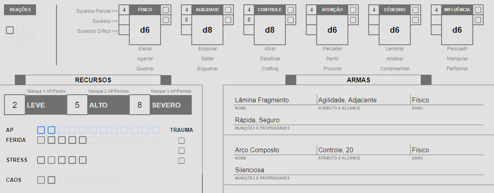
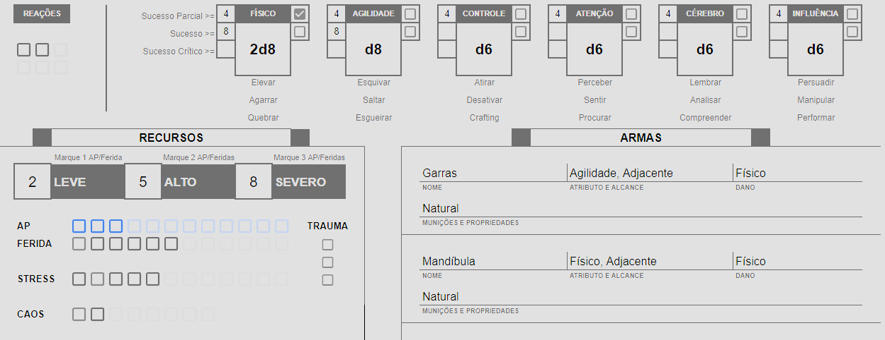

# Combate

Criaturas hostis atacam os jogadores enquanto estão atravessando uma floresta, uma discussão em algum bar se agrava para agressão, estes são exemplos de combate. Em HB o combate não segue uma ordem de iniciativa e não há rodadas ou turnos para cada jogador; existem dois turnos: do GM e da equipe de jogadores. Caso não haja ataque surpresa por parte do GM, a equipe começa jogando e qualquer jogador executa quaisquer ações desejar, na ordem em que desejar. O GM pode jogar com seus NPCs no momento que os jogadores falham algum check, ou caso pague 3 [Terror](./resources.md#terror) quando Sucesso Parcial. Efeitos temporários ou ações com tempo de uso são acompanhadas por [Countdowns](./countdown.md). O fluxo do combate segue os seguintes passos:

## Passo 1: Determinar Surpresa
O primeiro passo de um combate é determinar se houve surpresa tanto do lado do GM, quanto dos jogadores.

### GM Surpreende Equipe
Caso os NPCs surpreendam a equipe de jogadores, todas as criaturas do GM estão ativas e ele pode executar seu turno. No momento que não houver mais criaturas ativas e ações não podem mais ser executadas, a vez passa para os jogadores e o combate segue normalmente.  

### Equipe Surpreende GM
Caso os PCs surpreendam os NPCs, os jogadores começam jogando e a primeira ação de cada jogador é realizada com **Vantagem**. No momento que um jogador <ins>falhar</ins> em algum check, ou caso o GM pague 3 Terror quando Sucesso Parcial, a vez passa para o GM e o combate segue normalmente.  

### Não Houve Surpresas
Caso ninguém surpreenda ninguém, todas as criaturas do GM estão Inativos e o combate segue normalmente.

## Passo 2: Turno da Equipe
No momento que a primeira rodada de surpresa passa ou caso não tenha havido surpresa, a equipe de jogadores executa seu turno. Considere os seguintes pontos durante o turno da Equipe de jogadores:

- Todos jogadores recuperam todas suas reações.
- Todos os [Countdown](./countdown.md#countdown-turno) dos jogadores diminuem em 1.
- Não há ordem de iniciativa, qualquer jogador pode executar ações na ordem que quiser.
- Não há limites de [Ações](./actions.md) que cada jogador pode executar antes de precisar passar sua "vez", jogadores podem realizar quantas e quaisquer ações desejarem.  
  Há apenas limitações de recursos, como por exemplo Habilidades que custam Caos.  
- GM pode realizar apenas [Reações](./actions.md#reações) com seus NPCs, estando ativos ou inativos.
- GM recebe 1 [Token de Ativação](./resources.md#token-de-ativação) para cada ação que um jogador realizar. Caso a quantidade de Tokens de Ativação seja igual a quantidade de NPCs, para cada ação que um jogador fizer, o GM recebe 1 [Terror](./resources.md#terror).

Os resultados dos checks dos jogadores influenciam o decorrer do jogo:

**Sucesso ou Sucesso Crítico:** Jogadores seguem jogando.   
**Sucesso Parcial:** GM pode jogar caso gaste 3 [Terror](./resources.md#terror), caso contrário jogadores seguem jogando.  
**Falha ou Falha Crítica:** GM pode jogar.  

## Passo 3: Turno do GM
Considere os seguintes pontos durante o turno do GM:

- Todas criaturas recuperam todas suas reações.
- Todos os [Countdown](./countdown.md#countdown-turno) do GM diminuem em 1.
- Converter Tokens de Ativação extras em Terror.
- GM pode **ativar** criaturas gastando Tokens de Ativação. 1 Token = 1 Criatura ativa.
- O GM pode realizar uma ação para cada criatura ativa, deixando-a então inativa.  
  Algumas criaturas podem realizar mais de uma ação por ativação.
- Jogadores neste momento podem realizar apenas Reações com seus personagens.
- A vez passa para a equipe de jogadores assim que não houver mais criaturas ativas ou caso o GM queira passar antes.

## Passo 4: Resolução
O Combate segue o fluxo repetindo os passos 2 e 3, intercalando entre turnos de equipe e turnos do GM, até um dos lados ser completamente eliminado, fugir, ou aceitar alguma negociação de paz ou rendição, ou qualquer outra interação em acordo entre o grupo.

## Exemplo de Combate
_O personagem de Remella, Beck, e seu aliado, Mari'Jonna, estão andando por uma nave abandonada quando ao abrir uma porta, se deparam com três criaturas hostis. Como ninguém foi surpreendido, o combate começa normalmente. Todas as três criaturas do GM estão inativas._

### Fichas
Segue abaixo um resumo dos atributos e recursos dos personagens e criaturas envolvidas no combate:

#### Remella


#### Mari'Jonna


#### Inimigos

**Nome:** Ruptores
**Limites de Dano:** 2 | 5 | 8  
**Feridas:** 2  
**Reações:** 1  
**Atributos:** d8 em Físico e Agilidade, d6 em todos outros  

Para fins de melhor leitura, vamos chamar as criaturas do GM de Ruptor A, Ruptor B e Ruptor C.

#### Turno da Equipe
_Remella decide agir primeiro e atacar com seu arco o Ruptor A, ele faz um check de Controle e rola 5 no seu d8, resultando em Sucesso Parcial e simultaneamente causando 5 de dano._

```
O GM verifica os Limites de Dano de suas criaturas e 5 de dano resulta em Dano 
Alto, portanto ele marca 2 Feridas no Ruptor A. Como a criatura possui 
apenas 2 Feridas, ela morre. O GM recebe um Token de Ativação, mas a 
vez continua com a Equipe.
```

_Mari'Jonna decide agir agora, se movendo até o Ruptor C e realizando um ataque com suas Garras._ 

```
Antes do jogador realizar o check, o GM anuncia que o Ruptor C irá usar sua 
reação de Esquivar, gerando uma Disputa.
```

 _Mari'Jonna faz um check de Agilidade e rola um 7, resultando em um Sucesso Parcial, enquanto o GM faz seu check de Agilidade e rola 8, resultando em Sucesso. O Ruptor C consegue Esquivar sem receber dano algum._

```
O GM recebe seu segundo Token de Ativação e a vez continua com os jogadores.
```

_Mari'Jonna pede para agir novamente e Remella concede. Mari'Jonna ataca novamente o Ruptor C, mas desta vez com sua Mandíbula. Como esta criatura já usou sua reação no ataque anterior, ela simplesmente tomará o ataque. Mari'Jonna faz um check Físico com seus 2d8 e rola 8 no seu Dado Principal e 3 no seu Dado Caótico, resultando em Sucesso e causando 11 de dano na criatura do GM._

```
O Ruptor C morre uma vez que Mari'Jonna causou Dano Alto, resultando em 
2 Feridas enquanto a criatura pode receber apenas até 2. Como há apenas 1
criatura viva no momento, em vez do GM receber um Token de Ativação, ele 
receber 1 Terror.
```

_Remella decide agir agora, atacando o Ruptor B com seu arco._

```
Antes do jogador realizar o check, o GM anuncia que o Ruptor B irá usar sua 
reação de Esquivar, gerando uma Disputa.
```

_Remella faz um check de Controle e rola 2, resultando em Falha e perdendo automaticamente a Disputa._

```
O GM recebe mais 1 Terror e a vez agora passa para ele.
```

#### Turno do GM

_Ruptor B recupera sua Reação._  
_O GM ativa o Ruptor B com um de seus Tokens de Ativação e converte o que sobrou em Terror. O GM possui 3 Terror no momento._

_O GM decide fazer o Ruptor B atacar Mari'Jonna que está mais próxima._

```
Antes do GM realizar o check, Mari'Jonna anuncia que irá Esquivar.
```

_Ruptor faz um check Físico e rola 8, resultando em Sucesso, enquanto Mari'Jonna Falha._

```
Mari'Jonna marca seus 3 AP uma vez que 8 de dano representam Dano Severo.
```

_Uma vez que o GM não possui mais criaturas ativas e sua única criatura já realizou uma ação, a vez passa para a Equipe._

#### Turno da Equipe

_Mari'Jonna recupera sua reação gasta._

_Remella decide agir primeiro e dessa vez se aproximar do Ruptor B e atacar com sua Lâmina Fragmento. Remella rola 4 no seu ataque com Agilidade, resultando em Sucesso Parcial e matando a criatura, uma vez que 4 representa Dano Alto e a criatura possui apenas 2 Feridas._ 

#### Fim do Combate
Como não há mais inimigos na cena, o combate acaba e o jogo volta para exploração._