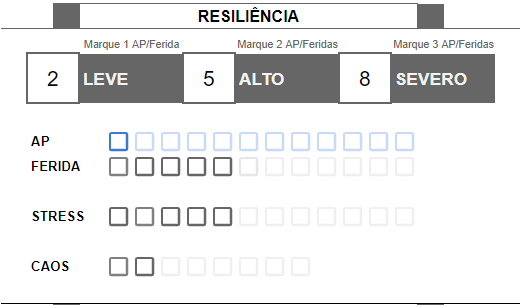

Recursos representam alguma característica de seu personagem com valor limitado e finito, e que determina sua resiliência ou que pode ser usado como pagamento para ações.

## Armor Points (AP), Feridas & Limites de Dano
Armor Points, ou AP, aparece quando seu personagem possui armadura, seja ela um equipamento ou natural. Seu tipo de armadura determina a quantidade de AP que você possui. Quando você recebe dano, caso possua AP, você irá marcar de 1 a 3 AP, representando o quanto sua armadura foi danificada.

Feridas representam lesões físicas e ferimentos experienciados por um personagem durante a aventura. A quantidade de pontos de Ferida variam entre as espécies e suas peculiariedades. Quando você recebe dano, você irá marcar de 1 a 3 Feridas, representando o quanto de vida você perdeu. Caso seu personagem possua AP, o dano é primeiramente diminuído de lá. Você só recebe dano em Ferida caso não haja AP para marcar.

Para evitar cálculos matemáticos e saber quantas Feridas você deve marcar, seu personagem possuirá **Limites de Dano**. Quando você recebe dano, compare o valor com o limite e então marque a quantidade de pontos apropriados em seu AP ou Ferida.

### Marcando AP e Ferida
Quando o GM lhe diz para tomar dano, compare o valor do dano com os limites e marque a quantidade de AP ou Ferida de acordo com o nível de dano:

- **Dano Severo** marque 3 AP/Ferida.
- **Dano Alto** marque 2 AP/Ferida.
- **Dano Leve** marque 1 AP/Ferida.
- **Dano abaixo Leve** você não recebe dano.

Se você marcar seu último AP, narrativamente sua armadura fica danificada e mecanicamente você fica sem AP até você recuperar de alguma forma, sendo ela automática com o tempo ou através de consertos ou recursos, isso vai depender da sua espécie.

Se você marcar sua última Ferida, você imediatamente deve fazer uma ação de [Morte](#morte).

Durante descansos ou através do uso de algum item, habilidade ou recurso, você poderá recuperar AP ou Ferida, assim apagando a marca da sua ficha.

## Stress

Stress representa seu estado mental, o quão estressado, desgastado você está mentalmente. Ao longo da aventura você receberá danos que podem ir direto para seu stress, ou algumas situações podem lhe desgastar, deixando-o com stress. Quando você recebe dano em Stress, esse dano é causado diretamente no marcador, sem se beneficiar da mecânica de limites de dano.

Você pode receber Stress quando:
- Alguma ação de uma criatura contra você, armadilha, dispositivo ou qualquer outro tipo de perigo diga explicitamente que causa dano em Stress.
- Você realiza alguma ação que explicitamente diga que você recebe Stress.
- Você realiza alguma ação e falha ou deve encarar complicações, e o GM indica que você deve receber Stress como consequência.
- Você role Falha Crítica em algum check.

Se você marcar seu último Stress, você imediatamente entra em **Pânico** e deve criar um [Trauma](#trauma).

Assim como AP e Ferida, você pode recuperar Stress durante descansos ou com o uso de algum item, habilidade ou recurso. Resultados de check como Sucesso Crítico e Explosão também recuperam Stress.

## Caos

Caos é a força e matéria que compõem tudo no universo. Os Regentes do Universo são os grandes mestres especialistas em uso dessa força, construindo e modificando constantemente o universo. Algumas criaturas, como seu personagem, podem utilizar a força do Caos de maneira limitada para realizar ações especiais. Cada espécie jogável manipula o Caos do seu jeito, transformando-o em um recurso que serve de alimento para suas Habilidades. Como por exemplo os Humanos utilizam o Caos como Energia Elétrica, os Evoras transformam o Caos em seda para suas teias ou veneno em suas glândulas, os Symbions integram o Caos em sua própria integridade física.

## Karma

Karma é um recurso que sua equipe pode ter e qualquer integrante da equipe pode utilizar para realizar algumas ações poderosas.

Sua equipe recebe Karma quando:
- Você ou outro integrante role Falha Crítica como resultado de algum check.
- Você ou outro integrante da equipe role 1 em um de seus dados caóticos.
- GM role Sucesso Crítico como resultado de algum check.

Sua equipe pode ter um número máximo de 5 karmas por vez. Cada integrante pode usar Karma apenas uma vez por sessão.

Sua equipe pode gastar Karma para:
- Realizar [Ações de Equipe](./actions.md#ações-de-equipe).

## Terror

Terror é um recurso exclusivo do GM e utilizado para balancear o campo de batalho com habilidades poderosas de inimigos.

GM recebe Terror quando:
- Sempre que um jogador realizar uma ação enquanto todas as criaturas do GM já estiverem ativas.

GM pode gastar Terror para:
- 1 Terror: Diminuir em 1 o Countdown de alguma Aflição causada em uma de suas criaturas. Pode ser usado apenas uma vez por turno do GM.
- Realizar habilidades especiais descritas em criaturas.