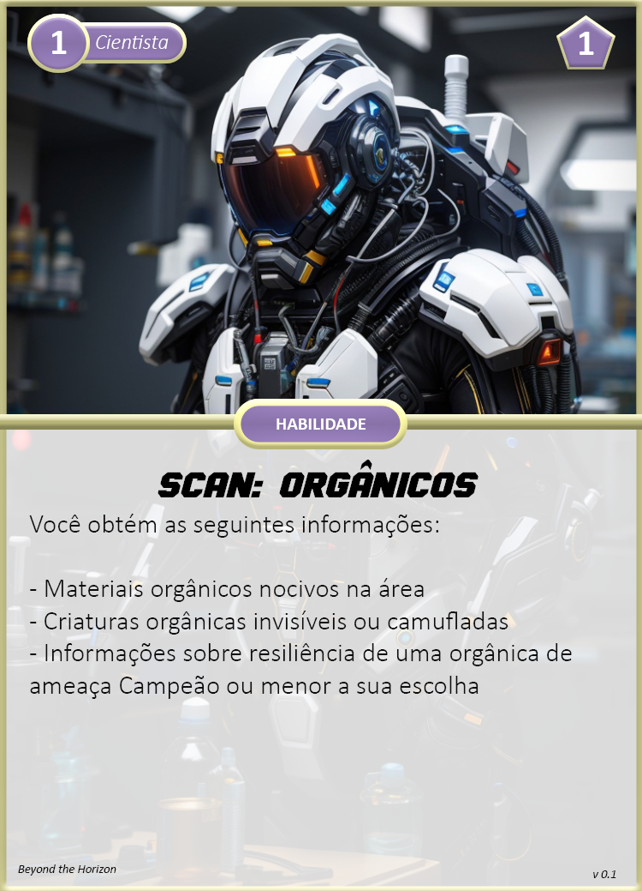
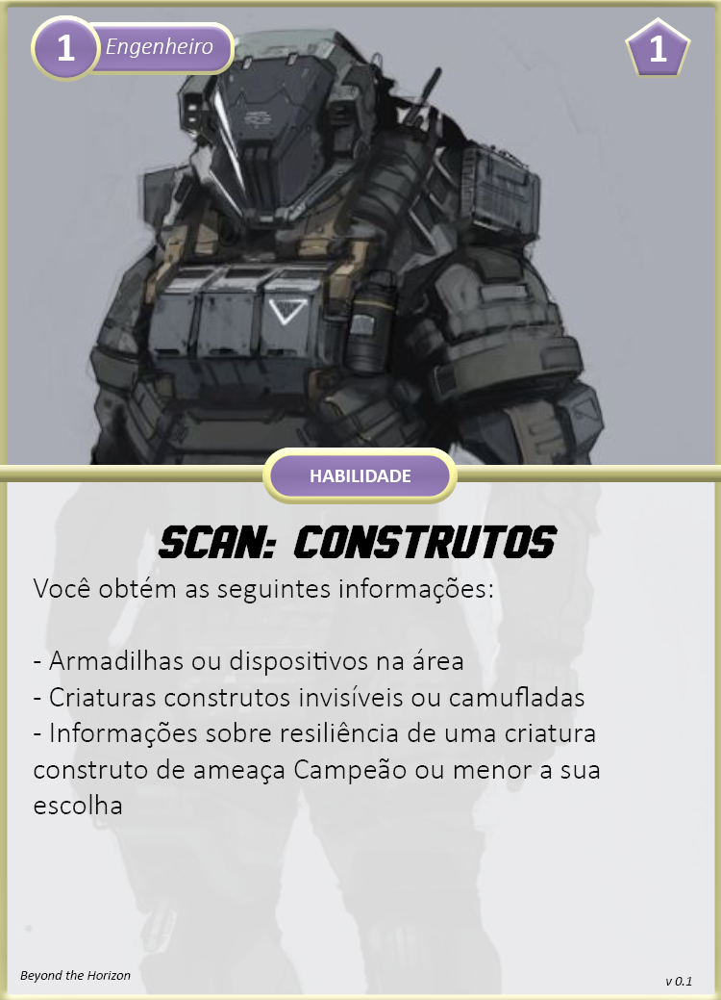
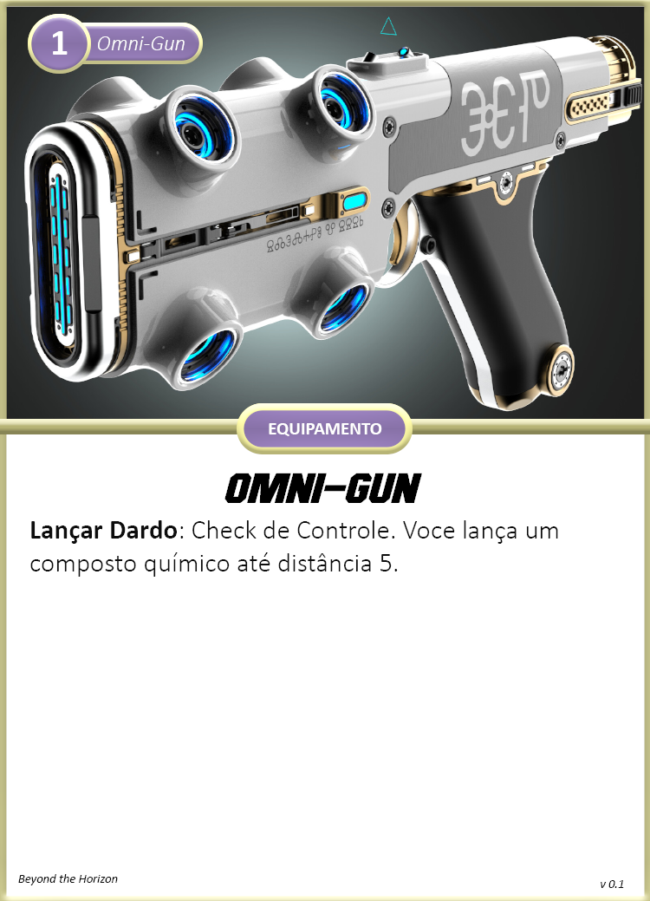
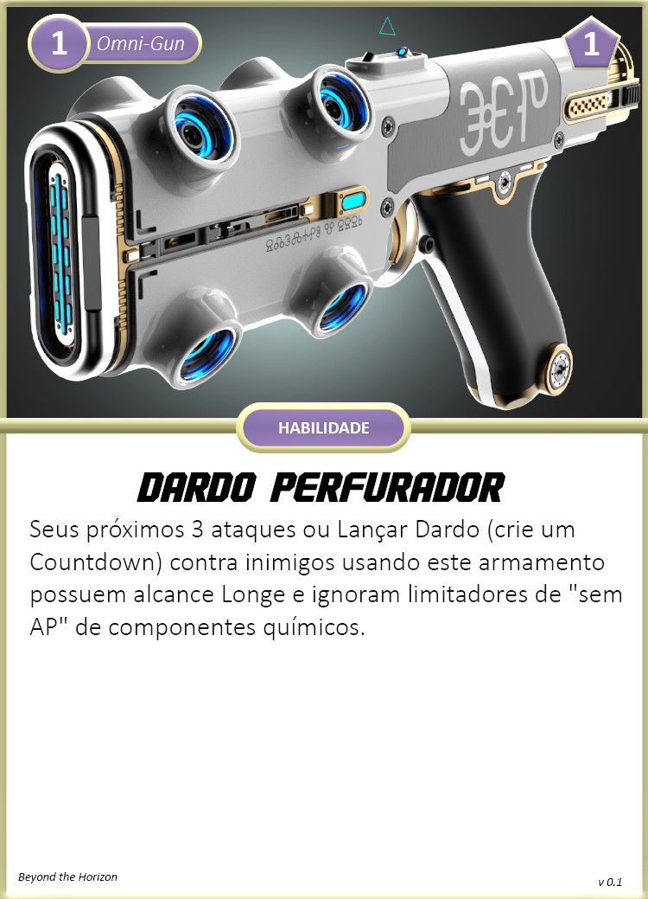
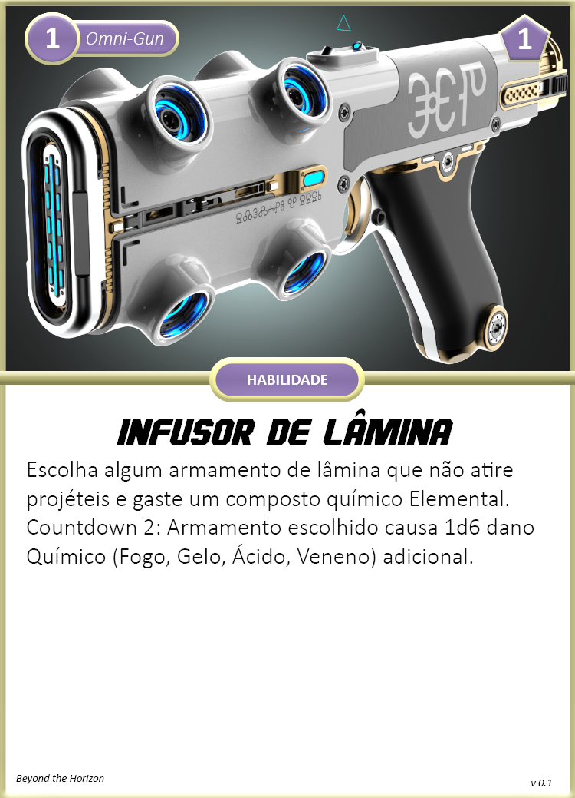
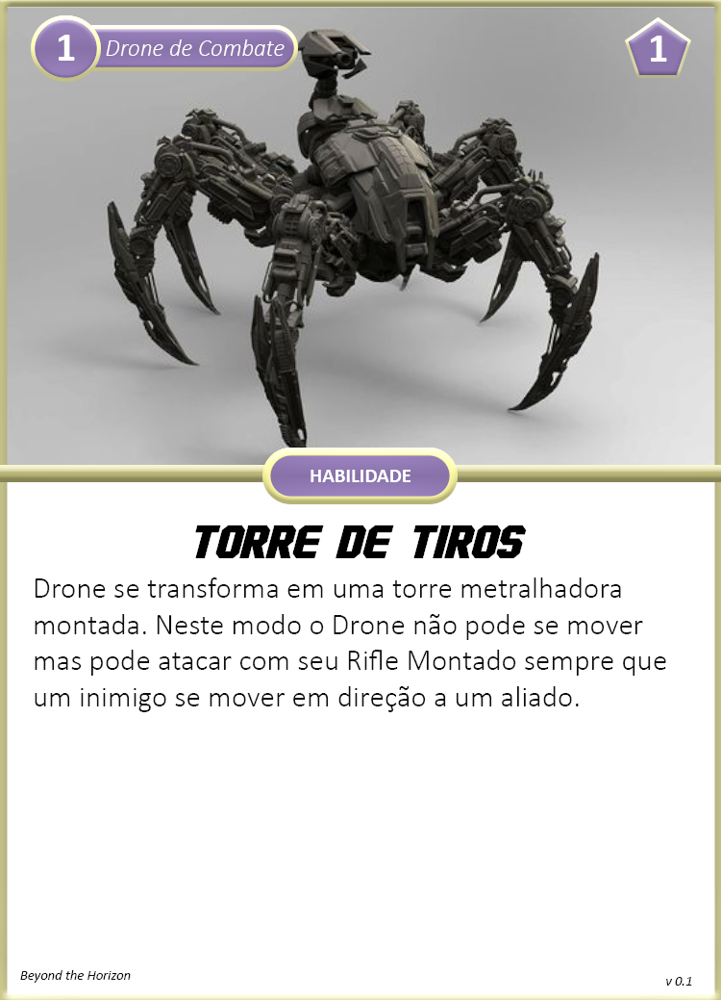
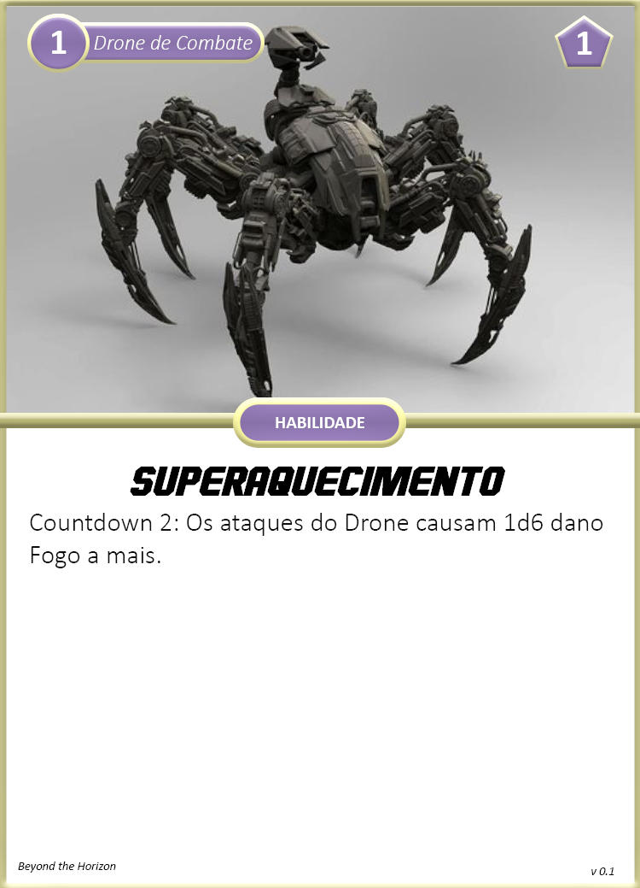

Classe especializada na aplicação das ciências, produção de equipamentos ou soluções químicas, atendimento médico e outras tarefas do tipo. Mais focada em suporte, ofensivo ou defensivo.

## Criando um Técnico

Ao escolher esta classe, considere o seguinte:

1. **Nível:** 1
2. **Reação:** 3
3. **Propriedades:** Orgânico, Humanoid.
4. **Tamanho:** Médio
5. **Movimento:** Terrestre, Muito Perto  
6. **Limites de Dano**: 3 - 8 - 13
7. **Feridas**: 4
8. **Stress**: 4
9. **Caos**: 3
10. Escolha entre uma das seguintes cartas de classe: **Cientista**, **Engenheiro**.
11. Receba suas **Armas:**
    1.  **Cientista:** Omni-Gun (possui carta) e Faca de Combate.
    2.  **Engenheiro:** TODO e Faca de Combate.
12. Escolha entre uma das seguintes **Armaduras:** A.N.E. Leve ou A.N.E. Média.
13. Receba seus **Equipamentos:**
    1.  **Cientista:** Laboratório Móvel, 2x Composições Químicas T1, 2x Kit Médico Simples
    2.  **Engenheiro:** Forja Móvel, 1x Granada, 1x Armadilha, 1x Kit Médico Simples.
14. Receba Perícia nas seguintes áreas da ciência:
    1.  **Cientista:** Biologia e Química.
    2.  **Engenheiro:** Engenharia e outra a sua escolha.
15. Receba seu **Companion:**
    1.  **Engenheiro:** Drone de Combate.
16. Avance 2 **Atributos** diferentes:
    1.  **Cientista:** Recomendável avançar os atributos Controle e Cérebro.
    2.  **Engenheiro:** Recomendável avançar os atributos Controle e Cérebro.
17. Escolha 2 cartas de **Aprimoramentos** de nível 1:
    1.  **Cientista:** Omni-Gun e A.N.E.
    2.  **Engenheiro:** TODO arma, A.N.E. e Drone de Combate.

## Cartas Nível 1

### Classes

{ width="280" }
{ width="280" }

### Armas

{ width="280" }
{ width="280" }

{ width="280" }

### A.N.E.

{ width="280" }
{ width="280" }

### Companion

{ width="280" }
{ width="280" }