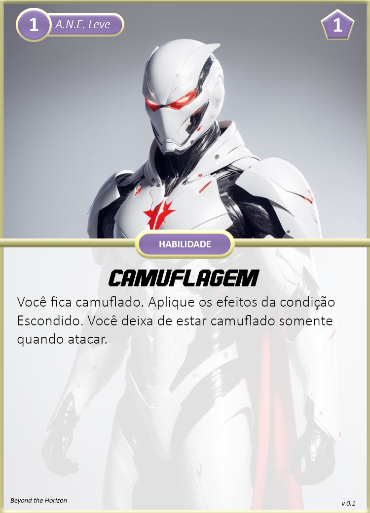

Classe composta por agentes gerais que efetuam papéis mais voltados ao funcionamento e necessidades de uma equipe, provendo serviços como comando e estratégia, pilotagem de veículos, e alimentação.

## Criando um Agente

Ao escolher esta classe, considere o seguinte:

1. **Nível:** 1
2. **Reação:** 3
3. **Propriedades:** Orgânico, Humanoid.
4. **Tamanho:** Médio
5. **Movimento:** Terrestre, Muito Perto  
6. **Limites de Dano**: 3 - 8 - 13
7. **Feridas**: 4
8. **Stress**: 5
9. **Caos**: 2
10. Escolha entre uma das seguintes cartas de classe: **Capitão**, **Piloto**.
11. Receba suas **Armas:**
    1.  **Capitão:** Pistola, Faca de Combate.
    2.  **Piloto:** Pistola Cinética (possui carta), Faca de Combate.
12. Escolha entre uma das seguintes **Armaduras:** A.N.E. Leve ou A.N.E. Média.
13. Receba seus **Equipamentos:**
    1.  **Capitão:** Neurotransmissor (possui carta), 1x Kit Médico Simples
    2.  **Piloto:** 1x Kit Médico Simples.
14. Escolha uma área da ciência para adquirir Perícia.
15. Receba seu **Transporte:**
    1.  **Piloto:** Planador de Combate.
16. Avance 2 **Atributos** diferentes:
    1.  **Capitão:** Recomendável avançar os atributos Atenção e Influência.
    2.  **Piloto:** Recomendável avançar os atributos Agilidade e Controle.
17. Escolha 2 cartas de **Aprimoramentos** de nível 1:
    1.  **Capitão:** A.N.E. e Neurotransmissor.
    2.  **Piloto:** Pistola Cinética, A.N.E. e Planador de Combate.

## Cartas Nível 1

### Classes

{ width="280" }
{ width="280" }

### Armas

{ width="280" }

### A.N.E.

{ width="280" }
{ width="280" }

### Equipamento e Transporte

{ width="280" }
{ width="280" }

{ width="280" }
{ width="280" }
