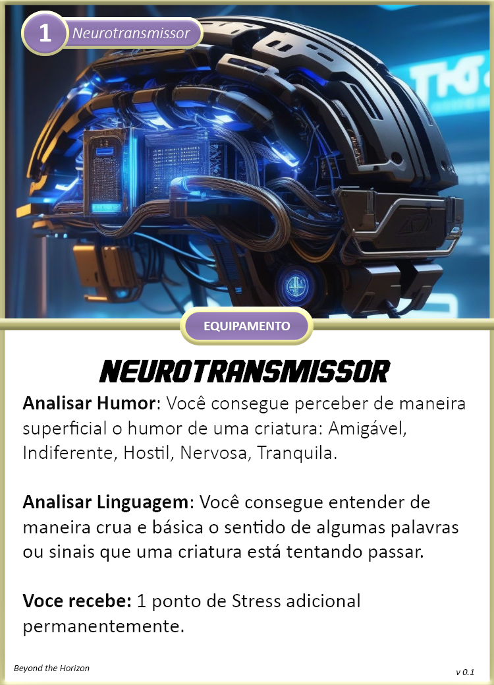
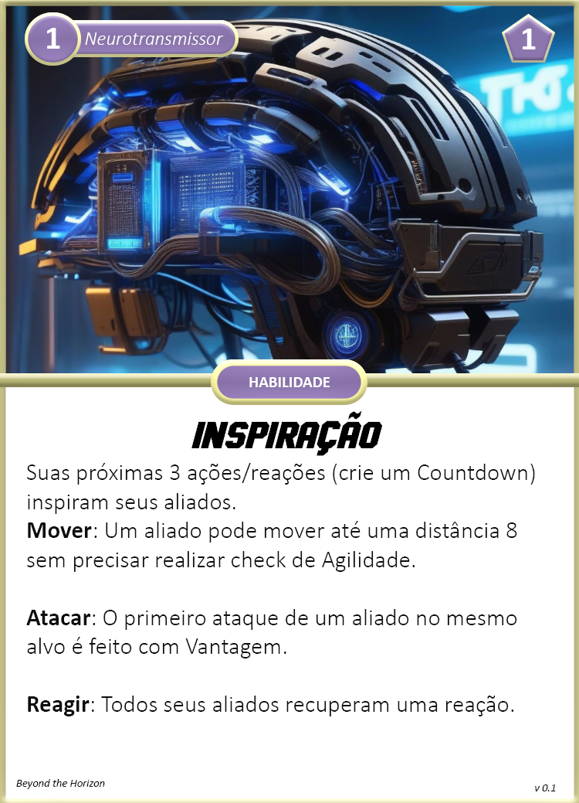

Especializado em comandar e organizar uma equipe para torná-los funcionais. Estrategista de batalha e manipulador de indivíduos.

{ width="190", align="right" }

## Criando um Capitão
Quando você escolhe esta especialização, considere o seguinte:

**Limites de Dano:** 3 <- 8 <- 13  
**Feridas:** 4  
**Stress:** 5  
**Caos:** 2  
**Armamentos Principais:** Pistola, Faca de Combate      
**Armadura:** A.N.E. Leve    
**Equipamentos:** Neurotransmissor, 1x Kit Médico Simples  
**Cartas:** Raciocínio Rápido e Neurotransmissor  
**Cartas de Aprimoramentos:** Separe as cartas de aprimoramentos para A.N.E. e Neurotransmissor    

### Escolhas

**Conhecimento Científico:** Escolha uma área de ciência para adquirir Perícia. Não há uma área em específica que esta especialização se destaque.  
**Atributos:** Capitães utilizam mais Atenção e Interação para suas habilidades.  
**Aprimoramentos:** Escolha 2 aprimoramentos dentre as cartas separadas.

## Cartas

{ width="280" }
{ width="280" }

{ width="280" }
{ width="280" }

{ width="280" }
{ width="280" }