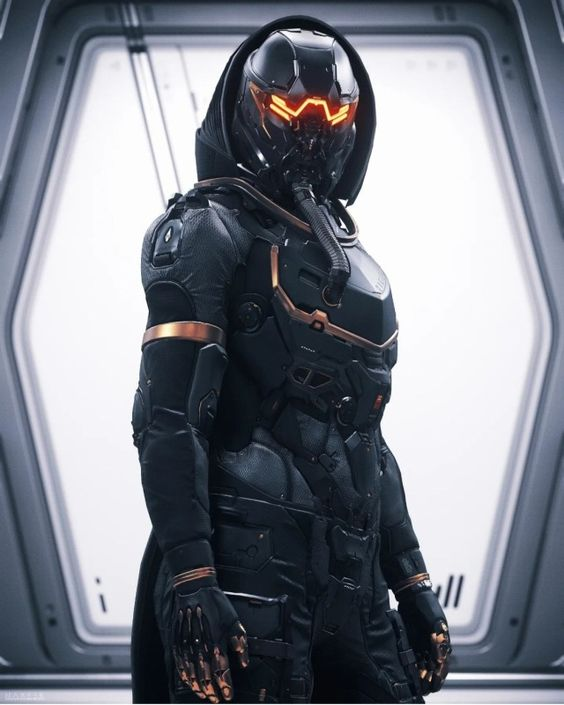
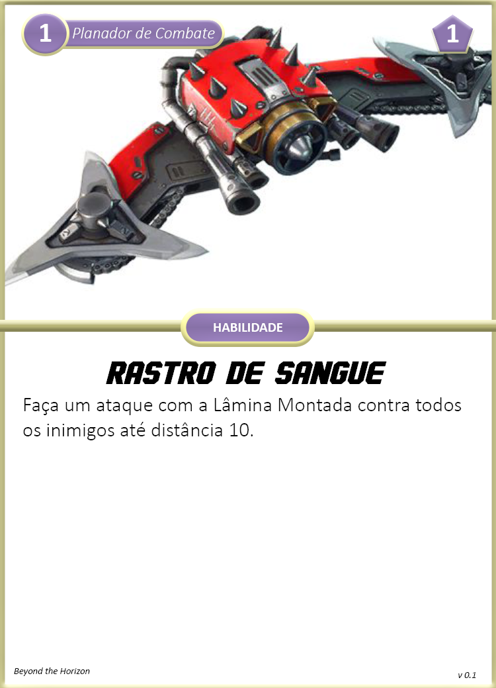

Mobilidade e velocidade no campo de batalha. Usa de seu Planador de Combate para mover rapidamente entre os inimigos e atacá-los sem tempo de reação ou bombardeia a linha inimiga do alto. Também usa sua Pistola Cinética que aproveita a energia de seus movimentos para causar e controlar o campo de batalha.

{ width="230", align="right" }

## Criando um Piloto
Quando você escolhe esta especialização, considere o seguinte:

**Limites de Dano:** 3 <- 8 <- 13  
**Feridas:** 4  
**Stress:** 5  
**Caos:** 2  
**Armamentos Principais:** Pistola Cinética, Faca de Combate       
**Armadura:** A.N.E. Leve     
**Equipamentos:** Planador de Combate, 1x Kit Médico Simples  
**Cartas:** Versatilidade        
**Cartas de Aprimoramentos:** Separe as cartas de aprimoramentos para A.N.E., Pistola Cinética e Planador de Combate  

#### Escolhas

**Conhecimento Científico:** Escolha uma área de ciência para adquirir Perícia. Possivelmente Engenharia seria a área mais indicada, caso você precise consertar um veículo.  
**Atributos:** Pilotos utilizam mais Agilidade e Controle para suas habilidades.  
**Aprimoramentos:** Escolha 2 aprimoramentos dentre as cartas separadas.  

## Cartas

{ width="280" }
{ width="280" }

{ width="280" }
{ width="280" }

{ width="280" }
