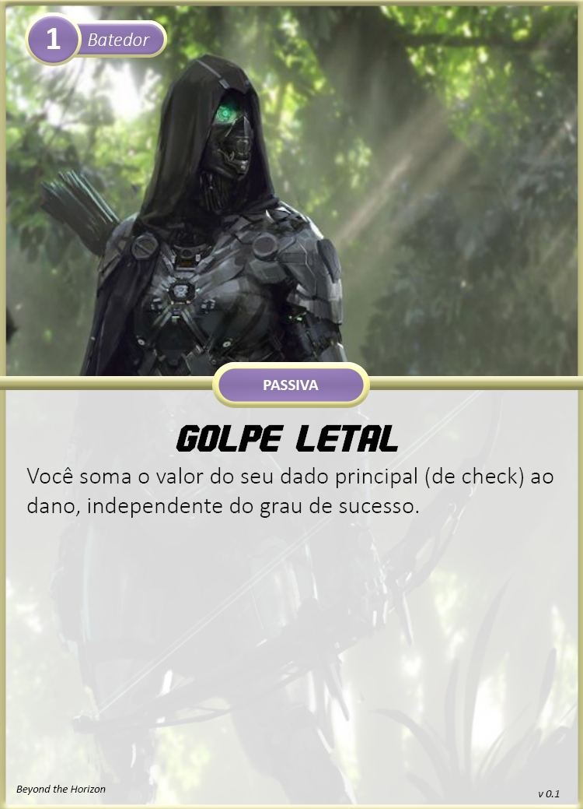
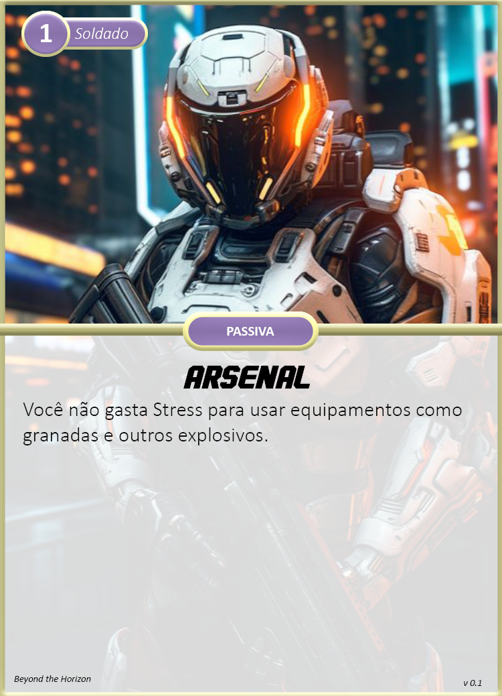
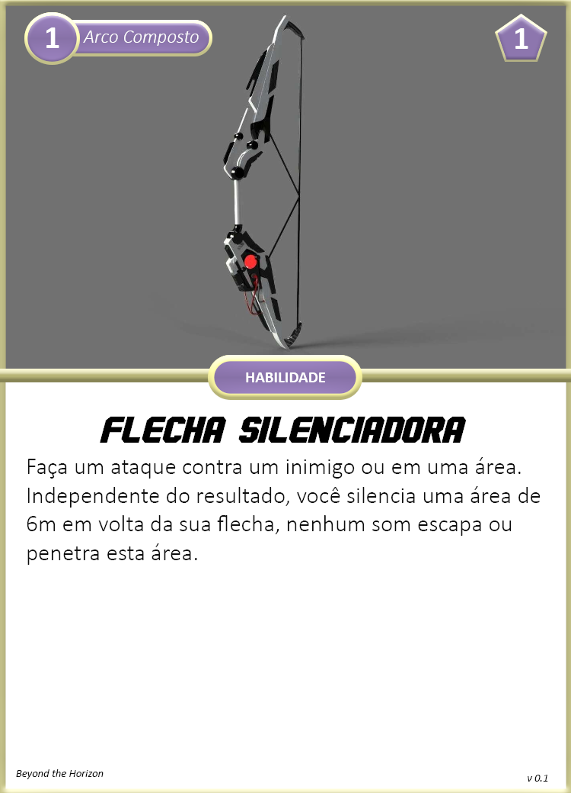
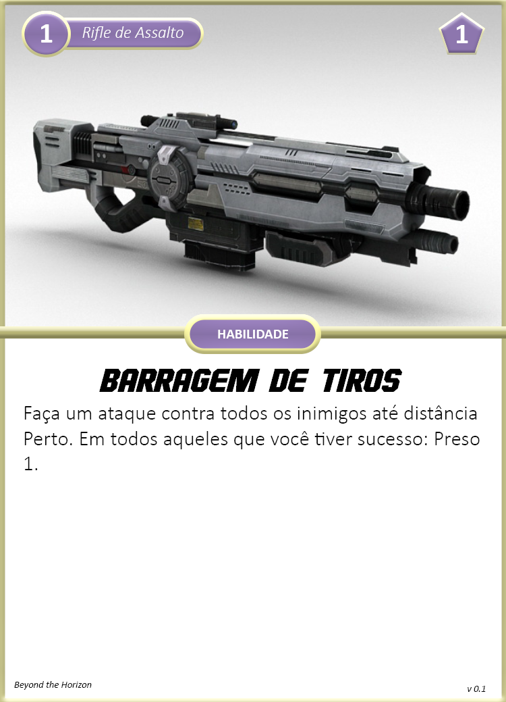
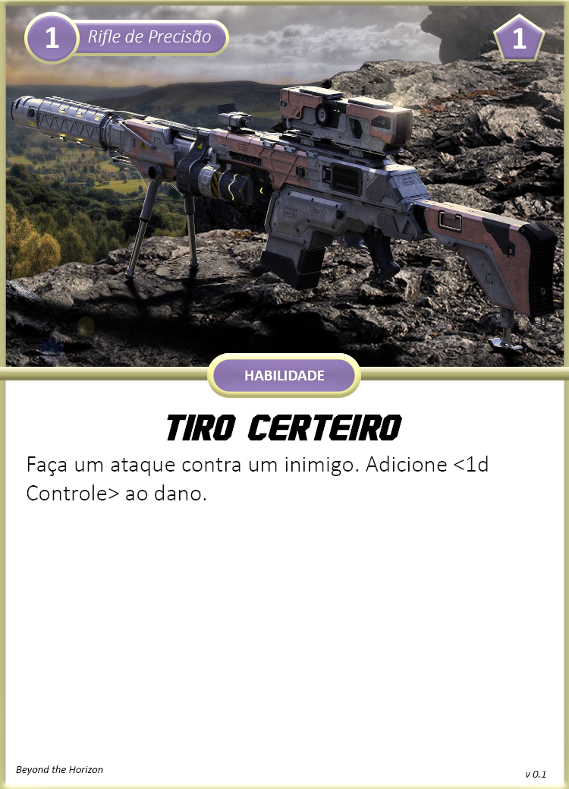
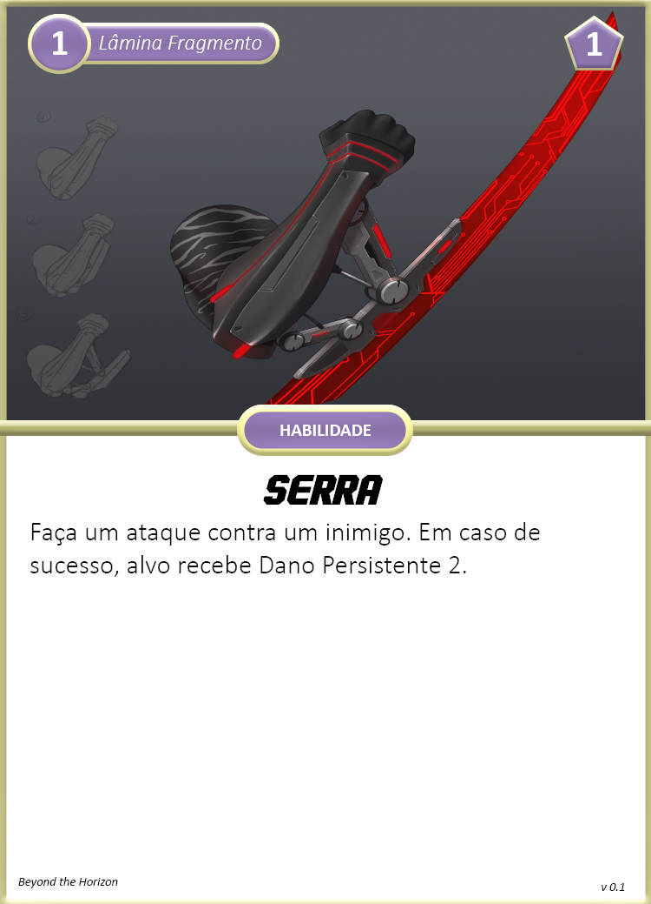
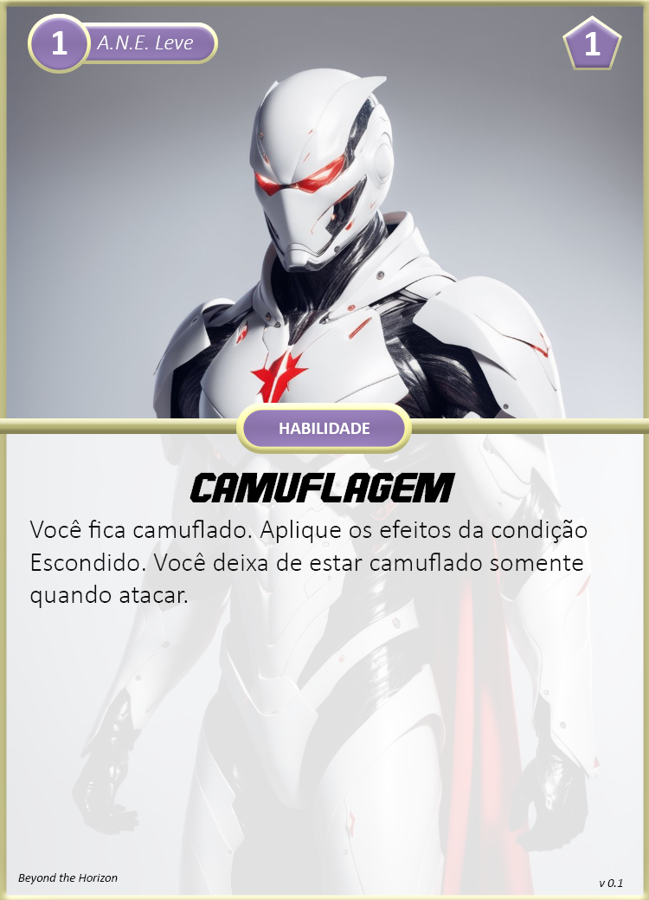
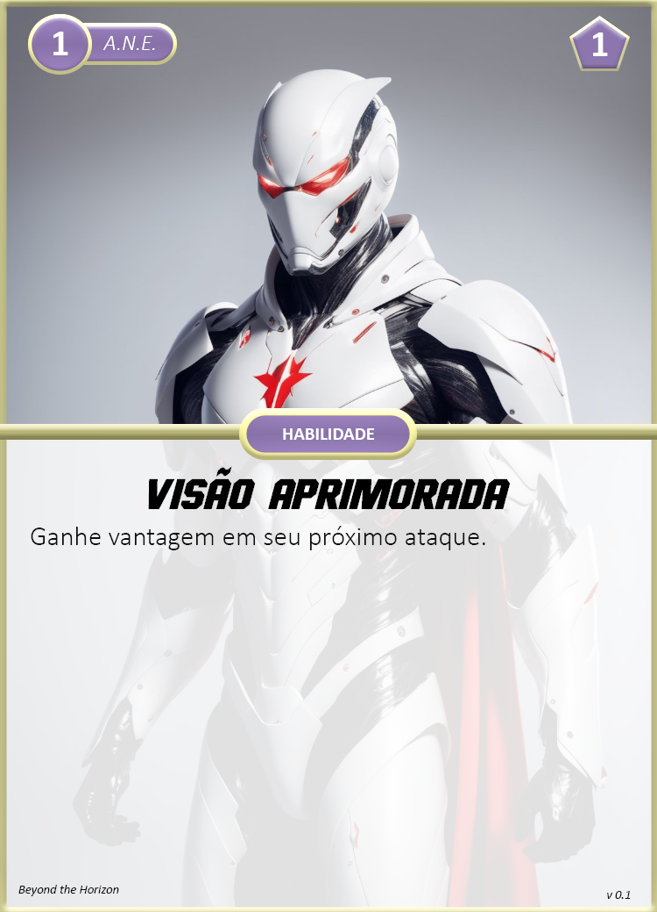

Classe responsável pela segurança de todos os outros integrantes da equipe. Especializada em combate direto e armamentos. Você pode prestar suporte ofensivo a longa distância ou na linha de frente surpreendendo seus inimigos com ataques silenciosos.

## Criando um Segurança

Ao escolher esta classe, considere o seguinte:

1. **Nível:** 1
2. **Reação:** 3
3. **Propriedades:** Orgânico, Humanoid.
4. **Tamanho:** Médio
5. **Movimento:** Terrestre, Muito Perto  
6. **Limites de Dano**: 3 - 8 - 13
7. **Feridas**: 4
8. **Stress**: 4
9. **Caos**: 2
10. Escolha entre uma das seguintes cartas de classe: **Batedor**, **Soldado**.
11. **Armas:** Arco Composto, Espingarda, Fuzil de Assalto, Fuzil de Precisão, Lâmina Fragmento.
    1.  **Batedor:** Escolha 2 armas.
    2.  **Soldado:** Escolha 3 armas.
12. Escolha entre uma das seguintes **Armaduras:** A.N.E. Leve, A.N.E. Média ou A.N.E. Pesada.
13. Receba seus **Equipamentos:**
    1.  **Batedor:** 1x Granada, 1x Kit Médico Simples
    2.  **Soldado:** 1x Armadilha, 1x Kit Médico Simples.
14. Escolha uma área da ciência para adquirir Perícia.
15. Avance 2 **Atributos** diferentes:
    1.  **Batedor:** Recomendável avançar os atributos Agilidade e Controle.
    2.  **Soldado:** Recomendável avançar o atributo Controle.
16. Escolha 2 cartas de **Aprimoramentos** de nível 1:
    1.  **Batedor:** As 2 armas escolhidas e A.N.E.
    2.  **Soldado:** As 3 armas escolhidas e A.N.E.

## Cartas Nível 1

### Classes

{ width="280" }
{ width="280" }

### Armas

{ width="280" }
{ width="280" }

{ width="280" }
{ width="280" }

{ width="280" }

### A.N.E.

{ width="280" }
{ width="280" }
