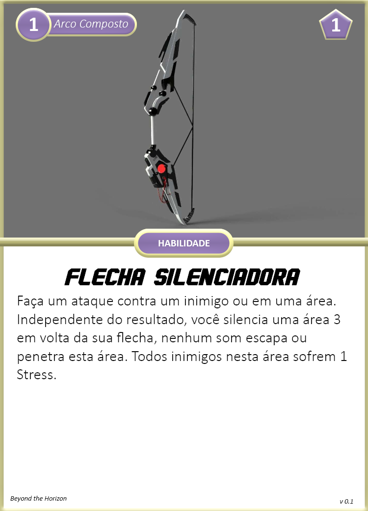

Esta é a Especialização ideal para quem gosta de se esgueirar pelas linhas inimigas e assassinar silenciosamente seus alvos, causando um enorme estrago no campo de batalha sem sequer ser percebido.

{ width="260", align="right" }

## Criando um Batedor
Quando você escolhe esta especialização, considere o seguinte:

**Limites de Dano:** 4 <- 9 <- 14  
**Feridas:** 4  
**Stress:** 4  
**Caos:** 2  
**Armamentos Principais:** Arco Composto, Lâmina Fragmento       
**Armadura:** A.N.E. Leve     
**Equipamentos:** 1x Armadilha  (escolha na hora do uso), 1x Kit Médico Simples  
**Cartas:** Golpe Letal      
**Cartas de Aprimoramentos:** Separe as cartas de aprimoramentos para A.N.E., Arco Composto e Lâmina Fragmento    

#### Escolhas

**Conhecimento Científico:** Escolha uma área de ciência para adquirir Perícia. Possivelmente Engenharia seria a área mais indicada, caso você queira desativar componentes digitais/mecânicos.  
**Atributos:** Batedores utilizam mais Agilidade e Controle para suas habilidades.  
**Aprimoramentos:** Escolha 2 aprimoramentos dentre as cartas separadas.

## Cartas

{ width="280" }
{ width="280" }

{ width="280" }
{ width="280" }

{ width="280" }