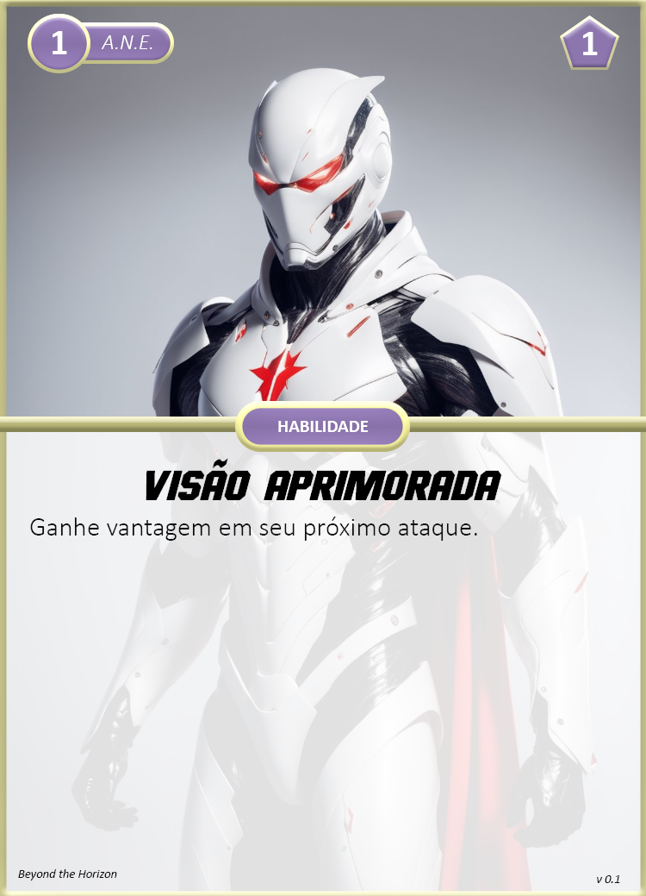
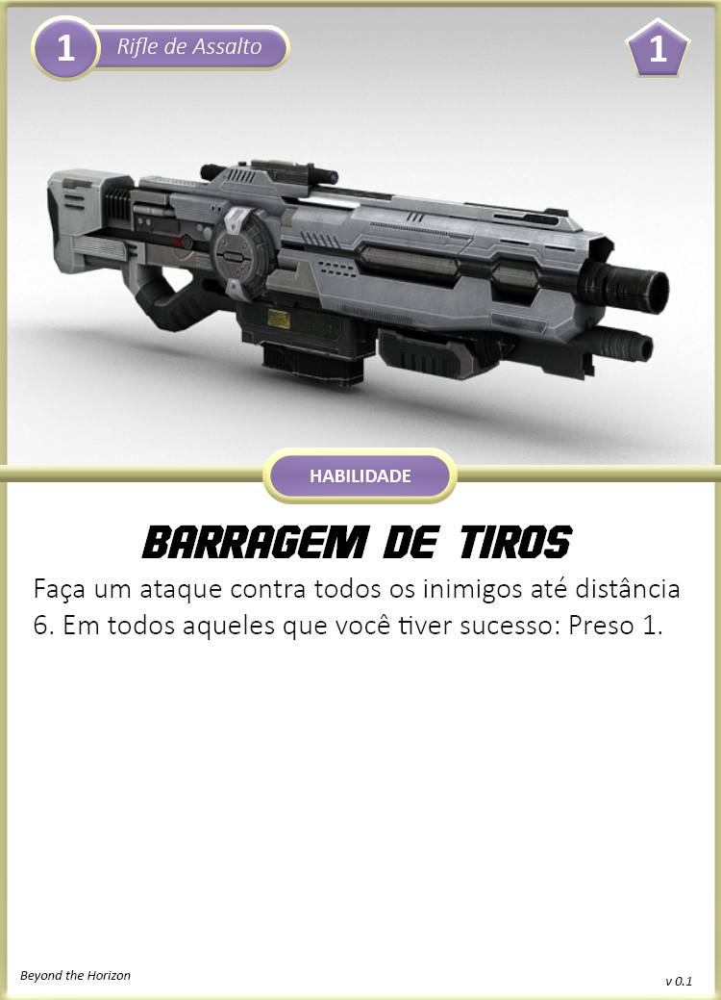

Especialização focada em combate média-longa distância, prestando apoio a seus aliados, suprimindo o avanço dos inimigos ou causando alto dano em alvo único.

{ width="250", align="right" }

## Criando um Soldado
Quando você escolhe esta especialização, considere o seguinte:

**Limites de Dano:** 4 <- 9 <- 14  
**Feridas:** 4  
**Stress:** 4  
**Caos:** 2  
**Armamentos Principais:** Rifle de Precisão, Rifle de Assalto, Espingarda     
**Armadura:** A.N.E. Médio     
**Equipamentos:** 1x Granada (escolha na hora do uso), 1x Kit Médico Simples  
**Cartas:** Arsenal      
**Cartas de Aprimoramentos:** Separe as cartas de aprimoramentos para A.N.E., Rifle de Precisão, Rifle de Assalto e Espingarda  

#### Escolhas

**Conhecimento Científico:** Escolha uma área de ciência para adquirir Perícia. Possivelmente Engenharia seria a área mais indicada, caso você queira fabricar munições.  
**Atributos:** Soldados utilizam mais Controle para suas habilidades.  
**Aprimoramentos:** Escolha 2 aprimoramentos dentre as cartas separadas.

## Cartas

{ width="280" }
{ width="280" }

{ width="280" }
{ width="280" }

{ width="280" }