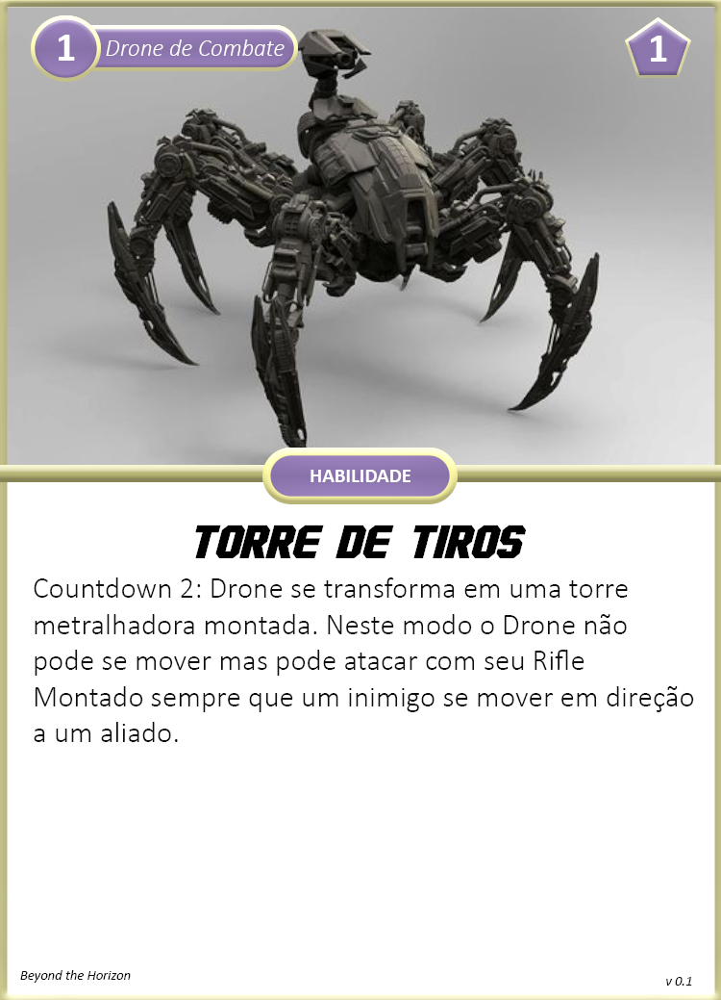

Especializado em tarefas envolvendo as ciências de Química e Biologia, como por exemplo produção de medicamentos, venenos ou até mesmo atendimento médico.

{ width="180", align="right" }

## Criando um Engenheiro
Quando você escolhe esta especialização, considere o seguinte:

**Limites de Dano:** 4 <- 9 <- 14  
**Feridas:** 4  
**Stress:** 4  
**Caos:** 2  
**Armamentos Principais:** Espingarda, Faca de Combate         
**Armadura:** A.N.E. Médio     
**Equipamentos:** Drone de Combate, Forja Móvel, 1x Granada  (escolha na hora do uso), 1x Kit Médico Simples  
**Conhecimento Científico:** Você recebe Perícia nas áreas de Engenharia e Física.  
**Cartas:** Scan: Construtos          
**Cartas de Aprimoramentos:** Separe as cartas de aprimoramentos para A.N.E., Espingarda e Drone de Combate    

#### Escolhas

**Atributos:** Engenheiros utilizam mais Controle e Cérebro para suas habilidades.  
**Aprimoramentos:** Escolha 2 aprimoramentos dentre as cartas separadas.

## Cartas

{ width="280" }
{ width="280" }

{ width="280" }
{ width="280" }

{ width="280" }
