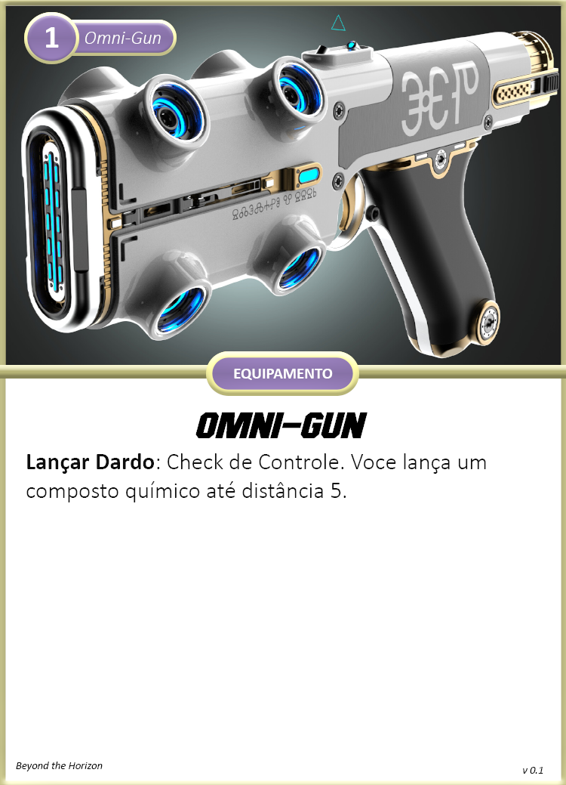

Especializado em tarefas envolvendo as ciências de Química e Biologia, como por exemplo produção de medicamentos, venenos ou até mesmo atendimento médico.

{ width="240", align="right" }

## Criando um Cientista
Quando você escolhe esta especialização, considere o seguinte:

**Limites de Dano:** 4 <- 9 <- 14  
**Feridas:** 4  
**Stress:** 4  
**Caos:** 2  
**Armamentos Principais:** Omni-Gun, Faca de Combate  
**Armadura:** A.N.E. Leve     
**Equipamentos:** Laboratório Móvel, 2x Composições Químicas T1(escolha quando usar), 2x Kit Médico Simples  
**Conhecimento Científico:** Você recebe Perícia nas áreas de Biologia e Química.  
**Cartas:** Scan: Orgânicos e Omni-Gun     
**Cartas de Aprimoramentos:** Separe as cartas de aprimoramentos para A.N.E. e Omni-Gun    

#### Escolhas

**Atributos:** Cientistas utilizam mais Controle e Cérebro para suas habilidades.  
**Aprimoramentos:** Escolha 2 aprimoramentos dentre as cartas separadas.
## Cartas

{ width="280" }
{ width="280" }

{ width="280" }
{ width="280" }

{ width="280" }
{ width="280" }