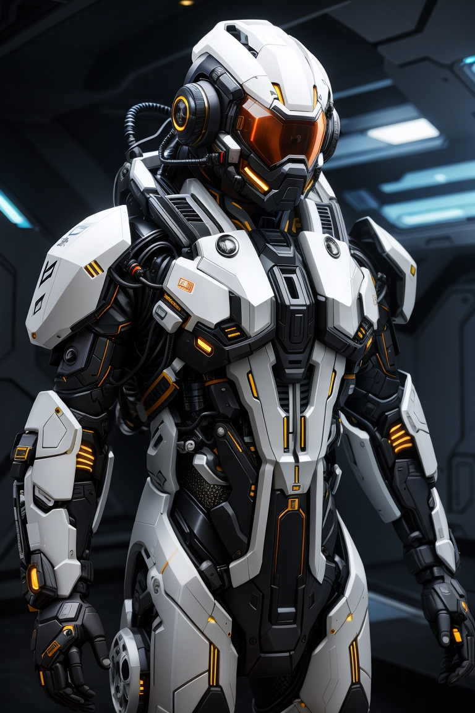

{ width="300", align="right" }

O primeiro passo para você começar a jogar Beyond the Horizon é criar o seu Personagem. Seu personagem seguirá uma arquitetura básica de Atributos, Ações, Reações e outras diversas características. A construção varia bastante de espécie para espécie, esta que define os valores iniciais de seus atributos, Pontos de Vida (HP), Energia (EN), Aprimoramentos, Habilidades, e outros detalhes.  
Seus atributos são compostos por 6 Aptidões e 7 Competências. Suas aptidões são: Físico, Agilidade, Controle, Atenção, Cérebro e Influência. Além do valor atribuído a cada aptidão, você também possuíra um Dado de Aptidão (AD) para cada. Suas competências são: Combate, Infiltração, Mobilidade, Busca, Ciência, Interação e Condução. Para ver quais outras características compõem seu personagem, veja no capítulo próprio.  

[Espécies](./species.md)  
Breve resumo das espécies jogáveis do mundo de Beyond the Horizon.

[Aptidões](./aptitudes.md)  
Parte do grupo de atributos do seu personagem. Identifica características físicas e sociais.

[Competências](./skills.md)  
Parte do grupo de atributos do seu personagem. Representa o quão bom você é para realizar ações.

[Resiliência](./resilience.md)  
Apresenta seus Pontos de Vida (HP), Pontos de Armadura (AP), Energia (EN) vulnerabilidades, resistência e imunidades.

[Anatomia](./anatomy.md)  
Apresenta seu tamanho, sentidos, partes e sistemas do corpo.  

[Rapidez](./quickness.md)  
Apresenta velocidade de movimento, iniciativa e quantidade de reações por rodada.  

[Conhecimento Científico](./scienceKnowledge.md)  
Apresenta seu nível de conhecimento científico, perícia e receitas.  

[Passivas](./passives.md)  
Indica se seu personagem apresenta alguma passiva que lhe concede benefícios sempre ou em determinadas situações.  

[Ações, Reações e Habilidades](./actionsReactions.md)  
Apresenta as ações, reações e habilidades disponíveis que você pode executar.  

[Armamentos e Armaduras](./weaponArmor.md)  
Apresenta seus armamentos, armaduras e munições (equipamento ou natural).

[Inventário](./inventory.md)  
Apresenta seu inventário e o que você possui.  

[Sobrevivência](./survival.md)  
Apresenta suas necessidades básicas de sobrevivência como respiração, alimentação e descanso. Também informa a ambientação em que você é acostumado a viver.  

[Aprimoramentos](./upgrades.md)  
Apresenta os aprimoramentos que você adquiriu ao decorrer dos níveis.  

[Nível](./level.md)  
Indica o nível, de 1 a 5, em que seu personagem se encontra.

[Parceiro](./companion.md)
Apresenta regras sobre parceiros, que são criaturas, animais ou construtos que seu personagem possua e obedece seus comandos.
