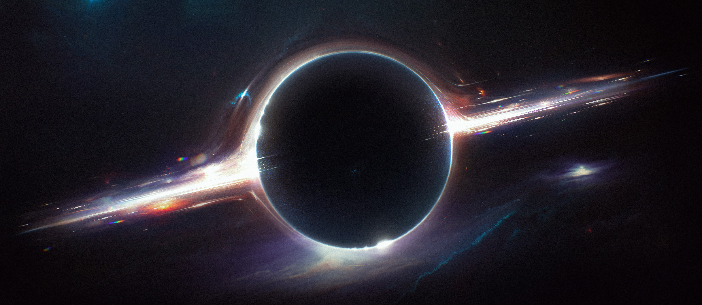

<!-- # Beyond the Horizon -->

# Seja bem vindo a Beyond the Horizon

<!--  -->

Beyond the Horizon (BTH) é um framework design para Tabletop Role-Playing Games (TTRPGs). Aqui você encontrará todas as regras e mecânicas base necessárias para jogar qualquer módulo entregue neste fomato. O universo é brevemente explicado aqui, porém informações mais detalhadas serão encontradas em módulos separados.

**Disclaimer:** Você verá vários termos em inglês nesta documentação, decidi seguir por este caminho uma vez que estes termos já estão bem difundidos em qualquer tipo de jogo, ou caso sua tradução para o português não seja boa ou totalmente equivalente com a ideia que estou tentando passar.

## O que é Beyond the Horizon?

O espaço é vasto, e nada amigável. Vácuo, radiação, buracos negros, supernovas, meteoros, tudo pode te matar ou até, antes disso, cozinhar seu cérebro. O espaço também não é vazio, diversas criaturas e outras formas de vida, além de Humanos, transitam e vivem por ele.  
BTH é sobre as variedade de espécies, é sobre contato e exploração, é sobre enfrentar seus medos, é sobre descobrir respostas para os mistérios do universo e sobreviver o tempo bastante para gritá-las, correndo o perigo de ninguém lhe escutar.  
Mais do que tudo, é sobre diversão e saber o que lhe espera Além do Horizonte.

## Como ler o jogo?

Nesta página você encontra informações gerais, um resumo do que o jogo se trata e como é jogado.  
No [Manuscrito](./0_complete/1_manuscript/index.md), você encontra as mecânicas e regras bases para jogar um jogo neste modelo.  
Na [Força Galáctica](./0_complete/2_galactic-force/index.md), você contra as espécies de Humanos (Ordinário e A.N.E.) e o meio em que habitam, assim como seus itens.

## Universo

O universo de Beyond the Horizon é equivalente ao nosso; mesmo sistema solar, galáxias parecidas, mesmas leis da física, porém, também tem grandes diferenças.

### Galáxias, Planetas e outros corpos celeste

No universo de BTH você verá nomes conhecidos de galáxias, estrelas, sóis, planetas e qualquer outro corpo celeste, porém, seus posicionamentos, composições e outros detalhes podem ser completamente diferentes.

### Regentes do Universo e Caos

O universo é regido por três forças (algumas culturas o classificam como entidades): Expansão, Ordem e Colapso. Estas três forças manipulam o Caos, que é a matéria que compõem tudo e todos, em ordem para manter o universo.  
O Caos pode ser trazido de seu plano para o nosso através da Expansão. A Ordem o manipula em sua forma desejada. Colapso detrói a ordem e recicla a matéria novamente para o plano do Caos.  
Criaturas, incluindo personagens jogáveis, objetos e outros fenômenos da natureza podem ter acesso limitado ao Caos e, força suficiente para manipulá-lo a sua vontade.

### Espécies

Variedade de espécies é o que não falta no mundo de BTH, sejam elas jogáveis ou não jogáveis. Cada espécie, incluindo Humanos, será apresentada através de módulos a parte. Cada espécie possuirá suas próprias características; mecânicas, comportamentais, sociais, etc.

### Tecnologia

A tecnologia depende do módulo e espécie que você decide jogar. Enquanto Humanos possuem acesso a alta tecnologia, outras espécies, como os Evoras, não fazem uso de tecnologia alguma.

## Módulos

Enquanto no [Manuscrito](./0_complete/1_manuscript/index.md) você encontra as mecânicas e regras bases para jogar BTH, detalhes do mundo e espécies serão encontradas em módulos separados. Quando você e seus amigos decidirem começar um jogo, um dos primeiros passos é a decisão do módulo e espécies que desejam jogar. Abaixo você encontra um preview do planejamento de módulos e espécies presentes em cada um.

| Espécie             | Características                                                           | Módulo           |
| ------------------- | ------------------------------------------------------------------------- | ---------------- |
| Humanos (Ordinário) | Humanos ordinários vivendo sua vida no espaço em outra galáxia.           | Força Galáctica  |
| Humanos (A.N.E.)    | Humanos que fazem uso da Armadura Nano Evolutiva.                         | Força Galáctica  |
| Hiver               | Humanos que abandonaram sua origem para viver em simbiose com o ambiente. | Simbiose         |
| Symbion             | Fungus que vive em simbionte com outras criaturas orgânicas.              | Simbiose         |
| Evoras              | Inseto em constante evolução e mutação.                                   | Evolução         |
| Realshir            | Elemental em busca de aperfeiçoamento de todos os elementos.              | Evolução         |
| Kitsuzen            | Pequeno humanoid com aparência de raposa. Sua cultura lembra a asiática.  | Arte e Corpo     |
| Egon                | Mistura entre lobo e lagarto que usa párticulas como areia, neve, etc.    | Arte e Corpo     |
| Humanos (Sanguine)  | Humanos na Terra e que possuem poderes baseados na cor de seu sangue.     | Nova Velha Terra |
| Humanos (Cyber)     | Humanos que lembram Cyberpunks.                                           | Nova Velha Terra |
| Humanos (Mística)   | Humanos que fazem uso de tatuagens mágicas baseadas em misticismos.       | Nova Velha Terra |

**Disclaimer:** Neste play test somente os Humanos Ordinários e A.N.E., do módulo Força Galáctica, estarão disponíveis para escolha.

## Jogadores e Game Master

Todo jogador, exceto um, assume o papel de um personagem jogável (PC). Você poderá ser um Humano Cientista ou Soldado, um Evoras Aracnídeo, um Egon do Deserto, ou diversas outras criaturas.  
Cabe a você imaginar e interpretar seu PC. Cada espécie tem suas peculariedades de cultura e personalidade, você encontra informações que lhe ajudam a interpretar um membro da espécie escolhida em cada módulo.  
Os personagens de jogadores são sempre os protagonistas das aventuras. O jogo é sobre você, sobre suas decisões, sua história.

O jogador restante é o Game Master (GM). Ele é responsável por narrar o mundo e a história. É responsável por desafiar o restante dos jogadores, seja por perigos do mundo e espaço, ou através de criaturas e monstros. Criaturas controladas pelo GM são chamadas de personagens não jogáveis (NPCs).  
É trabalho do GM colocar obstáculos e desafios para os PCs, forçando eles a pensar com cuidado e tomar decisões rápidas. Não é trabalho do GM tomar decisões ou realizar ações pelos PCs, ele não possui controle sobre eles.

O GM descreve os resultados e consequências das ações dos PCs, mas o que acontece de fato no jogo, é decidido durante o mesmo. No jogo, você descobre como sua história acaba.

## O Jogo

O jogo é uma conversação entre os jogadores e o GM, um bate e volta de narrativa. O GM descreve o que está presente e acontece em volta dos PCs, os jogadores descrevem como desejam reagir, o GM narra as consequências e resultados. Se uma situação crítica - como um combate - aparece, é hora de começar a rolar dados - veja mais em [Checks](./0_complete/1_manuscript/checks.md).

### Modos de Jogo

Você pode escolher entre dois modos de jogo: One Shot e Aventura.

One Shot é uma aventura de uma sessão apenas, com duração de 3 a 5 horas de jogo. Neste modo a narrativa é mais cinemática e envolve menos complexidade.

Aventura é uma campanha planejada para rodar entre 12 a 15 sessões, onde os PCs alcançarão nível máximo: 5. Este modo envolve uma trama bem mais complexa, com diversos finais possíveis. Também valoriza o desenvolvimento de personagem.

## Temas

Os temas variam entre os módulos e as espécies, alguns podendo focar mais em ficção científica (sci-fi) e terror, enquanto outros podem focar mais em exploração e fantasia. Abaixo você encontra os temas chaves que podem ser encontrados em abundância pelas aventuras.

### Exploração e "Sense of Wonder"

Curiosidade, mistério e perguntas assombram a mente de qualquer criatura. O universo está cheio destes mistérios, e também - com sorte - suas respostas. Explore mundos, encontre artefatos incompreensíveis de escala gigante, faça contato com organismos de complexidade inesplicáveis, descubra, se surpreenda.

### Sci-fi

Ficção Científica é o carro chefe de BTH. Utilize de todas as ferramentas ao seu alcance, toda a capacidade da sua espécie, para enfrentar os perigos do espaço.

### Fantasia

O Caos e algumas espécies trazem uma pitada de fantasia ao mundo de BTH, fazendo algumas ações, habilidades e fenômenos parecem mágica. Mas não deixe-se enganar, o universo é regido por forças e leis rígidas.

### Terror

No espaço o perigo é constante, e com o perigo vem o terror. Seja um fenômeno inexplicável ou uma criatura hostil e horrenda, os PCs estarão sempre a mercê do medo. Com a mecânica de Stress e Pânico isso se torna mais do que claro - veja mais em [Stress e Pânico]().

### Ação

Uma aventura não seria uma boa aventura sem ação. BTH é repleto de ação. Seja fugindo de um vulcão em erupção, correndo por sua vida de um monstro - ou, até mesmo, combatendo-o - a ação é garantida.

## Ferramentas de Jogo

Para jogar este jogo, você precisa das seguintes ferramentas:

- [Ficha de Personagem]()
- 1 a 3 conjuntos de dados (d6 a d12)
- Tokens para Ação, Reação e Terror
- Cartas de Moves, Habilidades, etc (opcional)

<!-- Horizon Beyond (HB) é um framework design para Tabletop Role-Playing Games (TTRPGs) com ênfase em _**Cinematic Tactical Adventure Sci-Fi Fantasy**_. Neste módulo você encontrará regras para mecânicas bases do jogo, garantindo seu funcionamento para os mais diversos temas de aventuras.

**Disclaimer:** Você verá vários termos em inglês nesta documentação, decidi seguir por este caminho uma vez que estes termos já estão bem difundidos em qualquer tipo de jogo, ou caso sua tradução para o português não seja boa ou totalmente equivalente com a ideia que estou tentando passar. -->

 <!-- com ênfase em sci-fi. Neste sistema você irá encontrar regras para mecânicas bases que irão guiar seus jogos nos mais diferentes estilos de aventuras e campanhas. Além disso você também encontra neste módulo o Universo base e as leis que regem ele. -->

<!-- ## Tema

Horizon Beyond tem como tema "Cinematic Tactical Adventure Sci-Fi Fantasy". Estas palavras-chaves servem para dar o sentimento do jogo, como ele funciona e como você, jogador, irá jogá-lo.

### Cinematic

Este jogo não tem como objetivo ser um survival, onde você deve manter nota de todo e qualquer recurso como munição, comida, água, etc. Este jogo tem como objetivo contar histórias, viver momentos cinematográficos, ter habilidades legais e matar monstros. Por isso, em HB, você não irá ter que ficar contando munições comuns, alimentos, água, saber se tem uma corda ou garfo ou qualquer outro item utilitário para sua aventura. Você também não terá que ficar se preocupando com peso ou tamanho do inventário, você tem que se preocupar em somente se divertir. Algumas munições especiais e materiais terão contagem, uma vez que são mais poderosos.

Neste jogo, alguns personagens poderão ter granadas, compostos químicos, armadilhas, munições especiais como dito anteriormente, e outros itens de combate. Mas você não precisa se preocupar qual granada ou armadilha de fato você realmente possui até você precisar usá-la. Você simplesmente irá anotar a quantidade de granadas no seu inventário, e quando a situação chamar, você anuncia qual tipo de granada da lista de granadas da sua espécie irá usar.

Durante combates, você também não precisa se preocupar quais ações você irá fazer no seu turno, só para chegar no seu momento e o cenário ter mudado completamente, forçando você pensar novamente o que irá fazer. Em HB, não temos ordem de iniciativa e turnos propriamente ditos. Existem o Turno de Equipe e Turno do GM. No Turno de Equipe, jogadores podem realizar quantas ações desejarem na hora que desejarem. Você pode correr até um inimigo, lançá-lo no ar de alguma forma, seu companheiro pular, socar ele em direção ao chão e você então cravar uma estaca nele; tudo isso sem se preocupar com limite de ações ou iniciativa, cada jogador joga quando quiser. O Turno do GM acontece quando algum jogador falha em algum check, e como no turno dos jogadores, o GM pode executar ações das suas criaturas na ordem que desejar, mas cada criatura só poderá executar 1 ação, a não ser que dito o contrário.

### Tactical

Apesar da ideia do jogo ser liberdade e diversão, ainda deve ser pensado taticamente o que você irá fazer, principalmente durante um combate. Personagens possuirão Limites de Dano, Feridas, Stress, Caos (usado para habilidades) e outros recursos que garantem a sua sobrevivência e forçam a você pensar como jogar. Combates são melhor realizados em um grid, seja de quadrados ou hexes, pensando em posicionamento e distâncias de ataques.

### Adventure

Em HB você irá criar um personagem de alguma espécie disponível e então irá viver uma aventura, digna de ser contada pelos bares e eventos do universo. Uma aventura nada mais é que uma mini-campanha que deve ocorrer em torno de 12 a 15 sessões, onde os personagens alcançarão seus níveis máximos e irão concluir seus objetivos com sucesso ou falhar miseravelmente.

Suas aventuras podem ter diversos objetivos, mas um **objetivo** final e de valor significativo deve ser determinado para o fim ser alcançado. O objetivo de sua aventura pode ser destruir um ninho do Enxame, liberar um planeta de uma ditadura ou até mesmo investigar o aparecimento de uma nave que se considerava a muito tempo destruída. Cada módulo irá informar exemplos de aventuras ligados as espécies presentes nele.

### Sci-Fi e Fantasy

Ficção Científica e Fantasia são definições as vezes meio subjetivas, em HB o mundo gira mais em torno de tecnologias e ciências, mas também há magia. As habilidades dos seus personagens são alimentadas pelo Caos, força que é matéria e substância de tudo o que há no universo. -->

<!-- ## Jornada

Em Horizon Beyond você e seus amigos irão realizar **Aventuras** com diversos personagens diferentes, contando suas histórias por diversos módulos e locais do universo, com várias espécies. Cabe ao Game Master (GM) e a equipe de jogadores viverem estas histórias, buscando a **Prosperidade** e evitando a **Ruína** do universo. -->

<!-- ## Game Master

Um dos jogadores deve tomar a função de GM. O GM tem como papel trabalhar com sua equipe de jogadores para decidirem detalhes de suas jornadas, módulos e objetivos de suas aventuras. Durante o jogo, cabe ao GM narrar a história e descrever as consequências das ações dos jogadores.

## Equipe e Personagens

Todos os jogadores que não forem o GM, serão personagens, os personagens formam uma **Equipe**. Personagens possuem uma **Espécie**, **Recursos**, **Atributos**, **Armas**, **Habilidades** e diversas outras características que os definem e atuam no funcionamento do jogo. Cada aventura será composta de uma equipe de personagens diferentes. -->
<!-- , portanto ao longo de uma jornada, jogadores viverão diversas vidas. -->

<!-- ## Módulos e Espécies

Como HB é um framework para TTRPGs, aqui você encontrará apenas uma visão geral sobre o universo e algumas criaturas que vivem nele. Módulos serão entregues separadamente, estes contendo a história de algumas espécies jogáveis e tudo que gira em volta delas: estrutura social, planetas, pontos de interesse, perigos e ameaças, etc.

### Planejamento

Abaixo você encontra uma tabela com planejamento de módulos e espécies. Leve em consideração que isto é apenas um planejamento e está sujeito a mudança. No momento apenas o módulo Força Galáctica será entregue, contendo a espécie jogável Humano.

| Módulo          | Espécies          | Exemplos de Aventuras                              |
| --------------- | ----------------- | -------------------------------------------------- |
| Força Galáctica | Humano            | Eliminar um ninho do Enxame. Explorar Relíquias. |
| Simbiose        | Hiver e Symbion   |                                                    |
| Evolução        | Evoras e Realshir |                                                    |
| Corpo & Alma    | Kitsuzen e Egon   |                                                    |

## Regentes do Universo e Caos

É conhecido que existem três forças regentes do universo: Expansão, Ordem e Colapso. Estas forças, também consideradas entidades por algumas culturas, manipulam o caos e controlam tudo o que é universo.

**Caos** é a matéria, substância, ou qualquer outra coisa que você deseja chamar, base para tudo que existe no universo. Personagens e algumas criaturas podem manipular o Caos, mesmo que de forma limitada, para realizar habilidades, estas que muitos consideram magia.

## Narrativa e Checks

O jogo gira em torno de uma narrativa onde o GM descreve uma **Cena** e os jogadores devem reagir a ela dizendo o que desejam fazer. Dependendo a ação desejada, será necessário realizar um **Check**, com ou sem oposição, este último sendo conhecido como **Disputa**.

Uma cena pode se agravar e se tornar um **Combate**, este que é gerenciado de forma fluída, sem iniciativas ou rodadas próprias.

A mecânica de resolução escolhida para HB é Step Dice Pool-ish. Personagens e criaturas possuem atributos, como Físico e Agilidade, e vinculados a eles, um **Dado Principal** que varia entre d6 a d12, quanto mais eficaz uma criatura ou personagem em um atributo, maior o dado. Todo o check é ligado a um atributo, portanto ao realizar um check, o jogador deve rolar o dado do atributo e verificar seu grau de sucesso: Falha, Sucesso Parcial, Sucesso e Sucesso Crítico.

Cada atributo também possui dois **Portões de Caos**. Ao abrir um dos portões, benefícios são obtidos, como por exemplo, ao abrir o portão do caos do atributo Físico, você recebe um ponto de Ferida a mais permanentemente. Além disso, você recebe um **Dado Caótico** que você irá rolar juntamente com o dado principal sempre que for realizar um check. Dados caóticos adicionam regras extras aos checks e cálculos de dano.

## Cartas

Durante a criação de personagem e o decorrer da aventura, você irá receber cartas, estas sendo referentes a espécie, armas, equipamentos, habilidades, passivas, aprimoramentos, etc. Além da ficha de personagem você também irá possuir estas cartas. Esta é uma forma de ajudar e facilitar a visualização do que seu personagem é capaz de fazer. -->

<!--

## Motivações

Jogando outros sistemas de RPGs eu tive ideias de mecânicas que gostaria de experimentar e também, o principal, resolver diversos aspectos que eu considero problemático ou que não acho divertido. Abaixo você encontra uma lista das minhas motivações e uma breve explicação de como estou tentando implementá-las.

<!-- #### Espécies -->
<!--
### Progresso -> Dados maiores e maior quantidade

Uma ideia que vim pensando há um tempo é ter um feedback de senso de progressão de forma física, não apenas números em um papel ou dígitos em uma tela. No D&D usa uma mecânica de _Roll and Add_, onde você sempre rola um d20 e adiciona modificadores que são números inteiros, eu queria algo menos estático do que modificadores e uma progressão de dados. Acabei me deparando com as mecânicas de _Step Dice_ e _Dice Pool_. Resolvi unir ambas e agora seus atributos definem o tamanho do dado (Step Dice), podendo ir de 1d6 até 1d12, e a quantidade portões do caos abertas definem o número de dados caóticos, que são dados extras que influenciam na resolução. Com isso um novato pode acabar rodando 1d6, enquanto alguém mais avançado pode acabar rolando 3d12! Dando um senso de progresso bem alto, através de feedback físico: tamanho e quantidade de dados.

### Remover "Set difficulty value"

Em D&D e vários outros sistemas, para saber se você foi bem sucedido em uma ação, o GM deve setar uma dificuldade e o jogador deve alcançar valor igual ou maior que ela. Um dos grandes problemas desse sistema é o GM de fato pensar em um valor apropriado de dificuldade. Com isso os GMs devem pensar em um valor pré-aventura ou improvisar na hora, tendo que pensar em diversos fatores e rolar um calculo quase que matemático pra decidir um valor satisfatório. Não é atoa que há centenas de horas e linhas de conteúdo sobre esse assunto. Em HB o único fator que diz se você foi bem sucedido ou não, é o seu próprio valor rolado em um check. Se uma ação é feita com oposição, esse valor será comparado a rolagem do openente.

### Skills fixadas em atributos

Um dos maiores problemas que vejo ao realizar ações no D&D e sistemas parecido, é que estas estão ligadas a skills, e estas skills estão ligadas de forma fixa a um atributo. Um exemplo claro é a _intimidação_ que está fixada ao atributo de _carisma_, fazendo assim, um Ogro gigante, feio e forte que possui 0 carisma, não conseguir intimidar um humano comum mesmo com sua força bruta e presença ameaçadora. Em HB possuímos apenas atributos e em cada um deles, alguns exemplos simples de uso, deixando ao GM e aos jogadores decidirem qual atributo é mais apropriada para cada ação. O GM sempre possui a palavra final.

### Matemática e cáculos

Cálculos matemáticos sempre atrapalham o desandar do jogo, quem nunca precisou pegar um número rolado no dado, somar diversos modificadores e então subtrair de outro. Em HB eu tentei resolver esse problema da seguinte forma:

**Remover valores de defesa:** Valores fixos de evasão, defesa ou armor class sempre geram a necessidade de algum cálculo de subtração. Em HB, se você rolou sucesso no check, você acerta o alvo, a não ser que este tente esquivar ou defender, mesmo assim, nenhum cálculo é realizado, há apenas a comparação entre números para decidir o resultado final do ataque.

**Feridas > HP:** Em diversos sistemas, quando alguma criatura toma dano, o valor é subtraído diretamente de seu HP, levando a cenários onde você deve calcular, por exemplo, 137 - 68. Em HB temos **limites de dano** e Feridas. A Ferida sempre será representado por alguma forma geométrica como um quadrado e sempre terá quantidade baixa, por exemplo, 10. Os limites de dano indicam quantas Feridas você marcará, podendo ser de 1 a 4. Se você receber dano que atinja seu limite de dano severo, você preenche 3 quadradinhos, simples assim. Ideia retirada do sistema Daggerheart.

Infelizmente não consegui me livrar de todos os cálculos, a soma ainda está presente na hora de comparar resultados de checks quando há disputa, oposição ou na hora de calcular o dano causado. O lado bom é que a soma é a operação mais fácil de se resolver dentre elas.

### Combate engessado

Rolar iniciativa é emocionante, porém a ordem de turnos acaba engessando as opções dos participantes. Digamos que o jogador A teve a ideia de uma ação no seu turno, mas ela depende da ação de outro jogador B. Jogador A então deve fazer seu turno, esperar o turno do jogador B e depois de toda uma volta na rodada, aí sim realizar sua ação, sendo que no momento pode acabar sendo tarde demais ou não fazer mais sentido. Por isso HB segue uma ideia de combate fluído, bem parecida com a de Daggerheart. Jogadores agem primeiro na ordem que quiserem, executando uma ação, o GM pode agir com seus NPCs assim que algum jogador falhar ou ter sucesso parcial em algum check, após um certo número de ações do GM ou caso ele falhe em algo, os jogadores voltam a realizar ações e assim vai até a resolução do combate. Para mais informações veja **Combate**.

### Cooperação

Em muitos sistemas de RPG cada um faz seu turno individualmente tentando alcançar um objetivo geral, causando assim um senso de individualidade, competição, mesmo que pertençam ao mesmo time. Em HB possui maneiras de cooperar diretamente com outros jogadores, criando um senso maior de time e pertencer. Jogadores podem ajudar outros durante checks, ou ainda mais, o time recebe pontos de **karma** que podem ser gastados para realizar ações em conjunto que causam efeitos e danos poderosos.  -->

<!-- #### Karma -->

<!-- Sucesso Crítico -->

<!-- Assassinato -->
<!-- Crafting
Interrogation
Negotiation
Investigation
Economy
Inventory
Encounter Easier
Conditions
Mini Campanha -->
