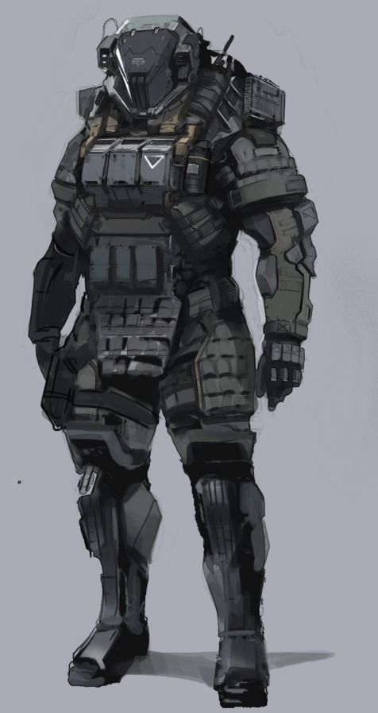

Especializado em tarefas envolvendo as ciências de Química e Biologia, como por exemplo produção de medicamentos, venenos ou até mesmo atendimento médico.

{ width="300", align="right" }

## Equipamento Inicial

[A.N.E. Média](../../../human/ane.md), [Espingarda](../../equipment/weapons.md#armas-de-fogo), 1x [Pistola](../../equipment/weapons.md#armas-de-fogo), 1x [Faca de Combate](../../equipment/weapons.md#armas-brancas), 1x [Drone de Combate](../../companion.md#drone-de-combate), 1x [Forja Móvel](../../equipment/equipments.md#forja-móvel), 20x [Munição Comum](../../../../rules/weapon_armor/ammo.md), 1x [Kit Médico Simples](../../scienceRecipes/biology.md#suporte).

## Ciência: Receitas

Abaixo você encontra uma tabela informando quais receitas você é capaz de produzir de acordo com seu valor na aptidão de cérebro. Você pode produzir os itens abaixo em qualquer local com seu forja móvel.

| Cérebro | Receitas                                                                                                                                                                                                                         |
| ------- | -------------------------------------------------------------------------------------------------------------------------------------------------------------------------------------------------------------------------------- |
| 30      | [Munição Comum](../../../../rules/weapon_armor/ammo.md), [Nano-Fix Simples](../../scienceRecipes/engineering.md#suporte), [Granadas](../../equipment/weapons.md#explosivos), [Armadilhas](../../equipment/weapons.md#armadilhas) |
| 40      | [Munição Avançada](../../../../rules/weapon_armor/ammo.md), [Munição Energia](../../../../rules/weapon_armor/ammo.md), [Aprimoramentos de Drone I](../../scienceRecipes/engineering.md#aprimoramentos-de-drone-i)                |
| 45      | [Nano-Fix Avançado](../../scienceRecipes/engineering.md#suporte), [Aprimoramentos de Equipamentos I](../../scienceRecipes/engineering.md#aprimoramentos-de-equipamentos-i)                                                       |
| 50      | [Aprimoramentos de Drone II](../../scienceRecipes/engineering.md#aprimoramentos-de-drone-ii), [Munição Míssil](../../../../rules/weapon_armor/ammo.md)                                                                           |
| 60      | [Aprimoramentos de Equipamentos II](../../scienceRecipes/engineering.md#aprimoramentos-de-equipamentos-ii), [Aprimoramentos de Drones III](../../scienceRecipes/engineering.md#aprimoramentos-de-drone-iii)                      |

## Drone de Combate

O [Drone de Combate](../../companion.md#drone-de-combate) é um construto parceiro e aliado seu e que obedece somente a você. Ele nunca age por conta própria, mas você pode comandá-lo a fazer uma ação geral e ele irá fazê-la até que concluca ou não seja mais possível. Para mais informações sobre parceiros, visite o capítulo [Parceiros](../../../../rules/companion.md).  
Considere sua aptidão de Cérebro para fins de dano extra.

#### Checks
Todo e qualquer check que seu drone precisar fazer, seja ele para esquivar, atacar, resistir a algum efeito, etc, é realizado por você, a capacidade de sucesso dele é determinada pelo quão bem você o construiu e programou. Caso seja necessário um check de competência, você usa Ciência. As aptidões relacionadas as ações do seu drone são a de Cérebro e Controle, a sua escolha. 

## Aprimoramentos

| Nível | Aprimoramentos                                                                    |
| ----- | --------------------------------------------------------------------------------- |
| 1     | Atributos + Perícia + [A.N.E. Média](../../../human/ane.md) + Legenda: Construtos |
| 2     | Aptidão + Drone: Torre + Drone: Laser                                             |
| 3     | Atributos + (Drone: Morteiro \| Drone: Sobrecarga)                                |
| 4     | Competência + Reforge + Drone: Escudo                                             |
| 5     | Atributos + (Drone: Bomba Magnética \| Drone: Parasita)                           |

### Aprimoramento de Atributos (1)

Você recebe 10 pontos de aptidão para distribuir, podendo colocar 10 pontos em uma das opções ou dividir 5 pontos em duas.
Você recebe 10 pontos de competência para distribuir, podendo colocar 10 pontos em uma das opções ou dividir 5 pontos em duas.

### Perícia (1)

Você possui perícia nas áreas de Computação e Engenharia.
Você pode escolher uma das outras áreas da ciência para adquirir Perícia.

### A.N.E. Média (1)

_Equipamento_  
Você recebe o equipamento A.N.E. Média.

### Legenda: Construtos (1) :arrow_forward:

_Habilidade (Procurar)_ \| _Energia, Utilidade_  
**Custo:** 1x Célula de Energia (EN)  
**Duração:** 5 min  
**Alcance:** 30m  
A.N.E escaneia o ambiente ao seu redor e exibe em seu visor informações básicas sobre contrutos nas proximidades.

- Você consegue saber se há armadilhas ou dispositivos detectores no local.
- Você recebe informação sobre a resiliência de todas as criaturas do tipo construto na área.
- Escolha uma das criaturas construto na área, você e todos seus aliados sabem seu Ponto Fraco.

### Aprimoramento de Aptidão (2)

Você recebe 10 pontos de aptidão para distribuir, podendo colocar 10 pontos em uma das opções ou dividir 5 pontos em duas.

### Drone: Torre (2) :arrow_forward: :large_orange_diamond:

_Habilidade (Interação - Equipamento)_ \| _Defensivo, Energia, Ofensivo, Utilidade_  
**Requerimento:** Drone de Combate  
**Custo:** 1x Célula de Energia (EN)  
**Duração:** 5 turnos  
**Alcance:** Alcance efetivo do drone
A.N.E reorganiza os componentes de seu drone o transformando em uma torre de tiros estacionária que ataca inimigos na área.

- Drone se transforma em uma torre de ataque.
- Drone não pode se mover.
- Drone pode atacar normalmente em seu turno.
- Drone pode usa sua reação automaticamente para atacar qualquer inimigo que entre ou já esteja na sua área de ação.
- Os ataques do drone são Fácil.
- Você pode cancelar essa habilidade em qualquer momento.

**Combo**  
_Gatilho: Aliado usa alguma habilidade que possua os marcadores defensivo ou suporte, e custa 2 ou mais ações._  
_Custo: 2 CP_  
Você pode acionar essa habilidade e comandar o drone a já realizar um ataque em cada inimigo ao alcance como parte deste combo.

**Especial:**

1. Se você tiver feito o aprimoramento Drone de Assalto: Drone tem 1 reação a mais por rodada.
2. Se você tiver feito o aprimoramento Drone Sniper: Alcance efetivo do armamento é dobrado.

### Drone: Laser (2) :arrow_forward:

_Habilidade (Interação - Equipamento)_ \| _Energia, Ofensivo, Utilidade_  
**Requerimento:** Drone de Combate  
**Custo:** 1x Célula de Energia (EN)  
**Duração:** 5 turnos  
A.N.E transforma a energia do drone em projéteis de laser, causando dano de energia nos seus ataques.

- O armamento do drone dispara lasers em vez da munição normal.
- Drone não consome munição.
- Os ataques do drone causam 1RM dano a mais.
- O dano total é convertido para o tipo energia.

### Drone: Morteiro (3) :arrow_forward:

_Habilidade (Interação - Equipamento)_ \| _Energia, Ofensivo_  
**Requerimento:** Drone de Combate  
**Custo:** 1x Célula de Energia (EN)  
**Duração:** 2 turnos  
**Alcance:** 30m  
**Área de Efeito:** Esfera 6m
A.N.E reorganiza os componentes de seu drone o transformando em um morteiro capaz de disparar mísseis e bombas.

- Drone se transforma num morteiro.
- Drone não pode se mover.
- Drone pode disparar os seguintes projéteis:
    - Granadas
    - Munição Míssel
    - Bola de Canhão
        - Bola de Canhão pode ser feita a partir de 10 sucatas e causa 4RF dano concussão.

### Drone: Sobrecarga (3) :arrow_forward:

_Habilidade (Atacar)_ \| _Controle, Energia, Ofensivo_  
**Requerimento:** Drone de Combate  
**Custo:** 1x Célula de Energia (EN)  
**Alvo:** Criatura com marcadores construto e energia, ou dispositivo eletrônico  
Seu Drone pula em alguma criatura ou dispositivo e libera uma grande quantidade de energia, causando dano em criaturas, aflições em construtos e desativando dispositivos.

- Drone salta em uma criatura ou dispositivo e libera uma descarga de energia.
- Criatura alvo <ins>não</ins> pode Esquivar ou Defender este ataque.
- Se o alvo é uma criatura:
    - A criatura recebe 2RM dano energia.
    - Se for um construto-energia, check físico ou Desconectado 2.
- Se o alvo é um dispositivo:
    - Se estiver desativado, você o ativa.
    - Se estiver ativo, você o desativa.

### Aprimoramento de Competência (4)

Você recebe 10 pontos de competência para distribuir, podendo colocar 10 pontos em uma das opções ou dividir 5 pontos em duas.

### Reforge (4) :fast_forward:

_Habilidade (Interação - Equipamento, Ajudar)_ \| _Energia, Suporte_  
**Requerimento:** Aliado deve estar usando uma armadura do tipo equipamento  
**Custo:** 1x Célula de Energia (EN)  
**Alvo:** Armadura do tipo equipamento  
**Alcance:** Adjacente  
A.N.E transfere parte de seus nano-robôs para alguma armadura do tipo equipamento, regerando AP e podendo também transferir EN junto.

- Você pode transferir AP seu para AP de alguma aliado com armadura do tipo equipamento.
    - Diminua a quantidade que você quiser do seu AP
    - Adicione esse AP ao seu aliado
- Você pode transferir 1 EN para um aliado humano.

### Drone: Escudo (4) :arrow_forward: :leftwards_arrow_with_hook:

_Habilidade (Interação - Equipamento)_ \| _Defensivo, Energia, Suporte_  
**Requerimento:** Drone de Combate  
**Custo:** 1x Célula de Energia (EN)  
**Gatilho:** Ataque é feito contra aliado que esteja atrás do drone  
**Duração:** 2 turnos  
A.N.E reorganiza os componentes de seu drone o transformando em um escudo móvel que provê alta proteção.

- Drone se transforma em um escudo torre 2m x 2m e 30cm de espessura. É considerado uma estrutura.
- Drone pode se mover normalmente.
- Drone não pode atacar.
- Aliados atrás do drone possuem Proteção Total.
- Qualquer ataque que pegue no Drone é absorvido e transformado em Energia (EN) para você ou o aliado.
    - 5 de dano = 1 EN.

### Drone: Bomba Magnética (5) :arrows_counterclockwise: :large_orange_diamond: 

_Habilidade (Interação - Equipamento)_ \| _Controle, Defensivo, Energia, Ofensivo, Utilidade_  
**Requerimento:** Drone de Combate  
**Custo:** 2x Célula de Energia (EN)  
**Duração:** 2 turnos  
**Área de Efeito:** 6m  
A.N.E transforma seu drone em um potente imã, puxando qualquer metal na região, garantindo uma grande quantidade armadura ao seu drone. Seu drone pode liberar todos os metais captados, causando uma explosão maior e mais letal que uma granada de fragmentação.

- Metais são puxados e integrados ao seu drone.
    - Inclui sucatas e outros metais.
        - Jogue 1d10 para determinar a quantidade
    - Inclui armamentos do tipo equipamento e feitos de metal
        - Inimigos devem realizar um check físico ou controle. Falha: Desarmados
- Drone recebe 1 AP para cada material integrado.
- Drone pode expelir os materiais integrados com uma enorme força (custo de 2 ações).
    - Esse ataque causa 1RF dano concussão para cada material expelido.
- Ao final da duração dessa habilidade, os materiais são simplesmentes jogados no chão.

**Combo**  
_Gatilho: Algum aliado causa 3 ou mais de dano em AP de algum inimigo, ou destrói um construto._  
_Custo: 2 CP_  
Adicione 3 sucatas aos materiais integrados caso essa habilidade teve como gatilho o dano ao AP. Adicione 5 caso o gatilho tenha sido a destruição de um construto.

**Especial:** Fica ao critério do MU determinar o tamanho e peso possível dos metais puxados e integrados, mas eles não deveriam ultrapassar muito o tamanho e peso do drone.

### Drone: Parasita (5) :arrows_counterclockwise:

_Habilidade (Atacar)_ \| _Controle, Energia, Ofensivo, Utilidade_  
**Requerimento:** Drone de Combate  
**Custo:** 2x Célula de Energia (EN)  
**Duração:** 3 turnos  
**Alvo:** Criatura com marcadores construto e energia, ou dispositivo eletrônico  
**Alcance:** 10m  
A.N.E cria um link entre seu drone e uma criatura do tipo construto ou dispositivo eletrônico, fazendo-o tomar controle do mesmo.

- Este ataque acerta automaticamente e o alvo <ins>não</ins> pode Esquivar ou Defender.
- Criatura alvo deve realizar um check Cérebro:
    - Sucesso: Recebe 2RM dano energia e fica Desconectado 2.
    - Falha: Criatura fica Controlado 3 por você.
        - Em qualquer momento, até o fim de Controlado, você pode comandar a criatura a ficar Incapacitado 2.
