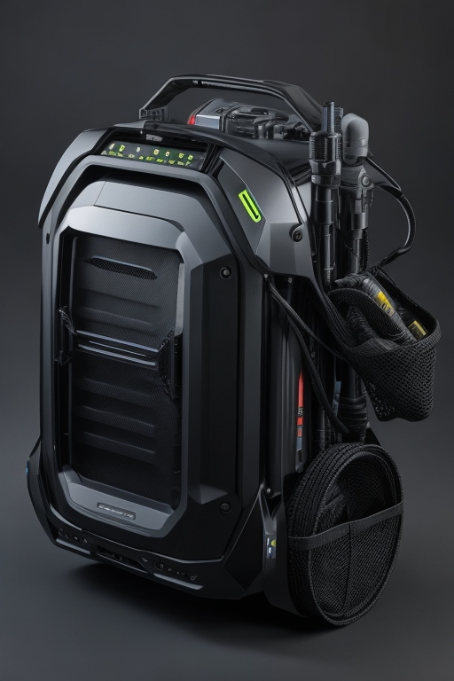
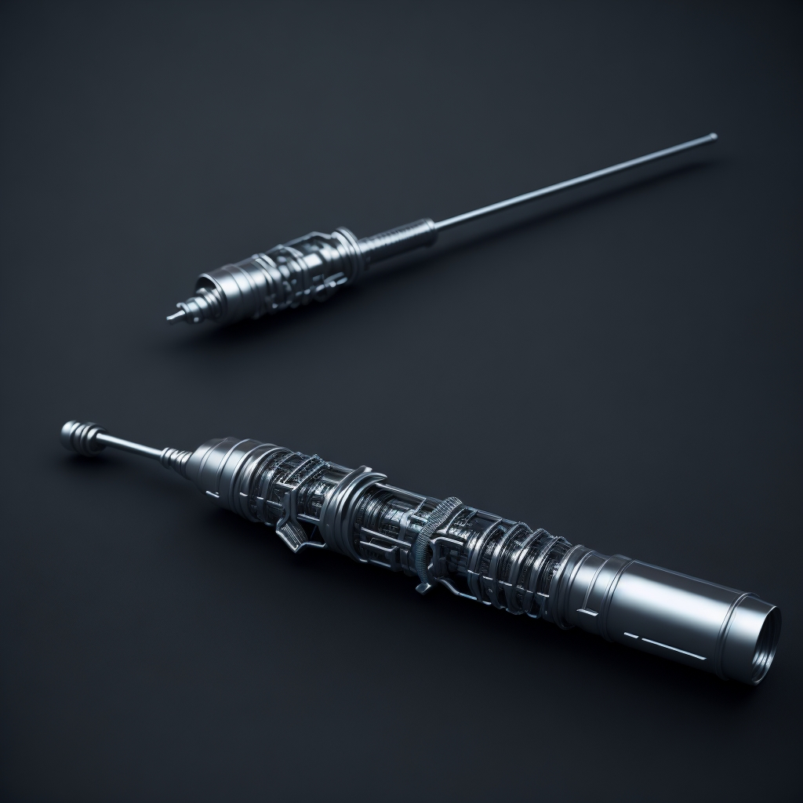
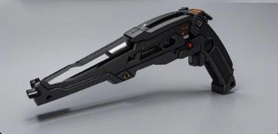
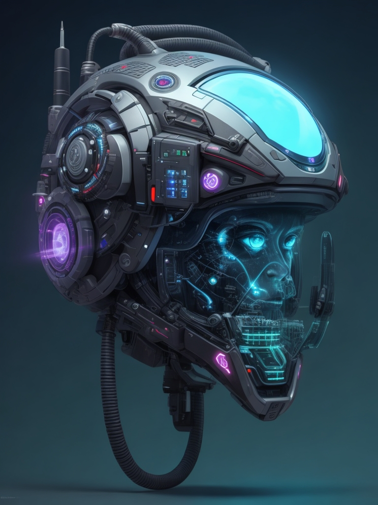

## Específicos de Classe

Abaixo você encontra equipamentos que são exclusivos e específicos para cada classe.

### Dardo Infusor

Dardo com compartimento para uma solução. Apenas Cientistas sabem realizar o manuseio deste equipamento. Você pode realizar as seguintes ações com um dardo infusor:

**Infundir Solução**: 1 ação. Você insere qualquer uma solução dentro de um dardo infusor.  
**Aplicar**: 1 ação. Você aplica ou libera o conteúdo do dardo infusor.

### Forja Móvel

{ width="200", align="right" }

Equipamento exclusivo dos Engenheiros. Têm a aparência de mochila rígida grande que você pode carregar nas costas, substituindo a mochila tática e tendo as mesmas funções. Você pode realizar as seguintes ações com a forja móvel:

**Criar Item:** Você consegue criar até 5 iten de engenharia do tipo suporte ou armamento e munição por vez.  
**Aprimorar:** Você consegue criar e aplicar até 1 aprimoramento por vez.

O tempo de criação ou aprimoração de cada item é informado na [Engenharia](../scienceRecipes/engineering.md).

### Infusor

{ width="200", align="right" }

Equipamento exclusivo dos Cientistas. Você pode carregar uma das suas soluções ou absorver do ambiente para pode aplicar em lâminas ou outros armamentos e armaduras através de habilidades. Seu infusor pode conter até 3 soluções ao mesmo tempo.
Você pode realizar as seguintes ações com um infusor:

**Carregar:** 1 ação. Você carrega uma das suas soluções no seu infusor.  
**Absorver:** 1 ação. Você absorve um elemento químico do ambiente para seu infusor.  
**Infundir:** 1 ação. Você infunde algum elemento químico em uma lâmina ou qualquer outro armamento de alcance adjacente. Armamento deve ser do tipo equipamento.  
Armamentos infundidos causam 1RF dano a mais do tipo do elemento por 2 turnos.

Você pode absorver ou carregar os seguintes:

- Fogo
- Gelo
- Ácido
- Energia
- Venenos

### Laboratório Móvel

{ width="200", align="right" }

Equipamento exclusivo dos Cientistas. Têm a aparência de mochila rígida grande que você pode carregar nas costas, substituindo a mochila tática e tendo as mesmas funções. Você pode realizar as seguintes ações com o laboratório móvel:

**Criar Soluções:** Você consegue criar até 5 soluções por vez.  
**Criar Dardos Infusores:** Você consegue criar até 5 dardos infusores por vez.  
**Criar Kit Médico:** Você consegue criar até 3 kit médicos por vez.

O tempo de criação ou aprimoração de cada item é informado na [Química](../scienceRecipes/chemistry.md) e [Biologia](../scienceRecipes/biology.md).

### Lançador de Dardos

{ width="200", align="right" }

Equipamento exclusivo dos Cientistas. Possui a aparência de uma pequena pistola com diversos componentes. Pode armazenar até 3 dardos infusores que você pode disparar para aplicar soluções em aliados ou inimigos. Você pode realizar a seguinte ação com esse armamento:

**Disparar:** 1 ação. Você lança um dos 3 dardos infusores. 10m de alcance.  
**Recarregar:** 1 ação. Você recarrega até 3 dardos infusores.

### Neurotransmissor

{ width="200", align="right" }

Equipamento exclusivo dos Capitães. Diretamente integrado no capacete da A.N.E. e é utilizado para realizar as habilidades neurotransmissoras dos capitães. Com o neurotransmissor, você consegue realizar a seguinte habilidade:

**Analisar Humor:** 1 ação. Você consegue perceber de maneira superficial o humor de uma criatura: Amigável, Indiferente, Hostil, Nervosa, Tranquila.

**Analisar Linguagem:** 1 ação. Através de uma análise da entonação, movimentação e maneirismos de uma criatura de linguagem desconhecida, você consegue formar uma base crua dela. Você entende de maneira geral o contexto da mensagem que a criatura está tentando lhe passar.

Além disso o neurotransmissor lhe concede **1 AP de Resiliência Mental (RM)**.

## Geral

Equipamentos dos mais diversos tipos, utilizados para os mais diversos propósitos e que podem ser utilizados por todos.

### Comunicador

Permite a comunicação subvocal entre aliados que também possuam um comunicador. Alcance de 100m.

### Lanterna de cabeça

Emite luz forte em área de 4m e luz fraca em uma área de 8m.

### Monitor de Informações

Interface que demonstra informações gerais sobre seu corpo (RF, RM, etc) e equipamentos em posse (quantidade munição, recursos, etc).
