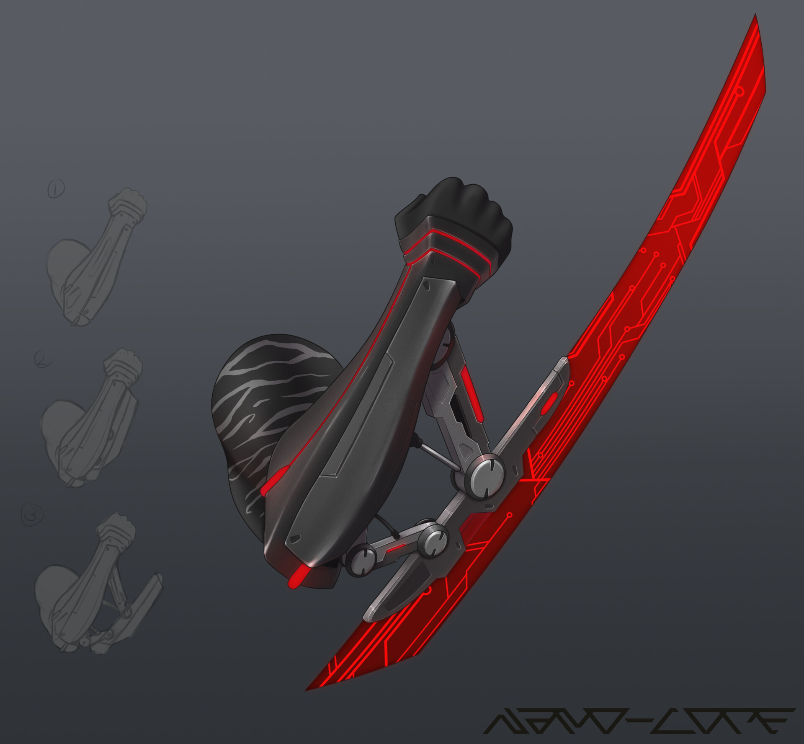

Todos os armamentos dos humanos são equipamentos por padrão. Alguns armamentos podem ter funções extras além de apenas causar dano no inimigo, como no caso do lançador de dardos, que lança dardos infusores de solução.  
Qualquer arma que tenha alcance diferente de adjacente usa automaticamente a aptidão de controle, a não ser que tenha o marcador Versátil, que então indicará qual outro atributo pode ser usado.  
Qualquer armamento da lista abaixo ocupa 1 no espaço de inventário do seu personagem.

## Armas Brancas

Armas brancas são armamentos que não se utilizam de fogo, combustão ou explosão para realizar o ataque.

| Nome            | Dano                 | Alcance    | Marcadores                         |
| --------------- | -------------------- | ---------- | ---------------------------------- |
| Arco Composto   | 1d8 perfuração       | 30m (120m) | 2-mão, Munição (Comum), Silencioso |
| Faca de Combate | 1d4 corte/perfuração | Adjacente  | Arremesso, Versátil                |

## Armas de Fogo

Armas de fogo são armamentos que necessitam de alguma forma de combustão ou explosão para realizar seu disparo.

| Nome              | Dano            | Alcance     | Capacidade | Marcadores                                   |
| ----------------- | --------------- | ----------- | :--------: | -------------------------------------------- |
| Espingarda        | 3d6 perfuração  | 10m (50m)   |     12     | 2-mão, Munição (Comum), Recarregar           |
| Fuzil de Assalto  | 2d8 perfuração  | 300m (600m) |     30     | 2-mão, Contínuo, Munição (Comum), Recarregar |
| Fuzil de Precisão | 2d12 perfuração | 500m (1km)  |     2      | 2-mão, Munição (Avançada), Recarregar        |
| Pistola           | 2d6 perfuração  | 50m (300m)  |     12     | Munição (Comum), Recarregar                  |

## Explosivos

Explosivos são armamentos que se utilizam de combustão ou energia para causar uma explosão liberando matéria ou elementos e causando dano e/ou condições em área. Podem ser arremessados até uma distância de 18m.

| Nome                    | Dano                 | Efeito                        | Área      | Check    |
| ----------------------- | -------------------- | ----------------------------- | --------- | -------- |
| Granada de Atordoamento | 2d4 neural           | Incapacitado 1 (Neural)       | Esfera 6m | Cérebro  |
| Granada de Fragmentação | 5d6 corte/perfuração | -                             | Esfera 6m | Esquivar |
| Granada de Luz          | 2d4 sensorial        | Inapto 1 (Visão)              | Esfera 8m | Atenção  |
| Granada Termobarica     | 3d6 fogo             | Dano Persistente 2 (Fogo) 2d4 | Esfera 4m | Físico   |

## Armadilhas

Armadilhas são armamentos que você posiciona sobre uma superfície e liberam algum efeito e/ou causam dano quando um certo gatilho é satisfeito. Inimigos devem realizar um check de Busca & Atenção para notar a armadilha.

| Nome                 | Dano          | Efeito                  | Área      | Gatilho                      |
| -------------------- | ------------- | ----------------------- | --------- | ---------------------------- |
| Mina de Atordoamento | 2d4 neural    | Incapacitado 1 (Neural) | Esfera 4m | Movimento na área de efeito. |
| Mina de Congelamento | 2d4 gelo      | Preso 2                 | Esfera 4m | Pressão sobre a mina.        |
| Mina Trovão          | 2d4 sensorial | Inapto 2 (Sentidos)     | Esfera 6m | Movimento na área de efeito. |

## Armas Especiais

Armas especiais são armamentos com características e comportamento bem específicos quanto ao seu uso. Geralmente exclusivas a uma classe/especialização.

| Nome             | Dano                                      | Alcance/Área       | Capacidade | Marcadores                                |
| ---------------- | ----------------------------------------- | ------------------ | :--------: | ----------------------------------------- |
| Cutelo do Chef   | 1d10 corte                                | Adjacente          |     1      | Especial, Munição (Químico), Recarregar   |
| Lâmina Fragmento | 1d6 corte/perfuração                      | Adjacente          |     -      | Acesso Rápido, Especial, Seguro, Versátil |
| Mixer-Gun        | 4d6 (o tipo depende)                      | 6m                 |     2      | Especial, Munição (Especial), Recarregar  |
| Pistola Cinética | 2d6 (concentrado), 1d6 (aberto) concussão | 6m (Horizontal 4m) |     3      | Especial, Munição (Especial)              |

### Lâmina Fragmento

{ width="300", align="right" }

Pequenos fragmentos interligados se tornam uma lâmina que você pode usar para ataques cortantes ou estocadas. Quando não em uso, a lâmina pode se fragmentar e se juntar a sua armadura, tornando o armamento escondido. Caso se perca um fragmento, A.N.E. é capaz de fabricar outro. Mesmo desfragmentada, os fragmentos se juntam rapidamente para formar a lâmina, tornando assim seu acesso rápido. Lâmina Fragmento também é considerada uma <ins>arma branca</ins> para fins de aprimoramentos.

### Pistola Cinética

{ width="300", align="right" }

Pistola Cinética não usa munição de forma normal, não há um projétil para disparar, em vez disso, ela armazena força cinética produzida por seu movimento, podendo armazenar até 3 por vez. Você recarrega 1 munição toda vez que anda pelo menos 6m com seu planador de combate. Há dois modos de tiro: concentrado e aberto.

**Tiro Concentrado:** Um sopro concentrado de ar que acerta apenas um alvo e causa 2d6 de dano concussão e empurra o alvo 4m para trás. O alvo também deve realizar um check Físico/Agilidade/Controle ou ficar Debilitado 1 (Corpo).  
**Tiro Aberto:** Um sopro de ar em área 4m a sua frente. Causa 1d6 de dano concussão aos alvos e ambos devem fazer um check Físico ou são empurrados 2m para trás.
