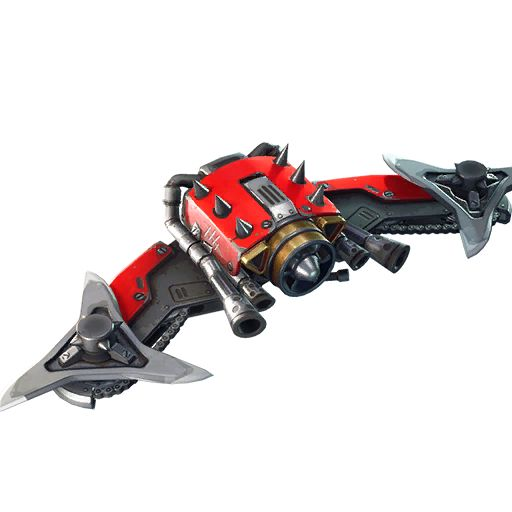

## Planador de Combate

{ width="250", align="right" }

_Veículo_ | _Flutuante_  
**RF:** 4 AP (+1AP no nível 3, +2AP no nível 5, +1AP se você tiver 50 em Cérebro).  
**Tamanho:** Médio.  
**Movimento:** Aéreo 10m. Altura de no máximo até 6m normalmente.  
**Ações:** Mover. Você pode comandar o planador para mover ou buscar você até uma distância de 100m.  
**Inventário:** 3x armamentos, 50x munições.  
**Autonomia:** 10km por descanso longo.

#### Armamentos

| Nome           | Dano           | Alcance   | Marcadores                                       |
| -------------- | -------------- | --------- | ------------------------------------------------ |
| Lâmina Montada | 1RF corte      | Adjacente | Acesso Rápido, Seguro                            |
| Rifle Montado  | 1RF perfuração | 20m (50m) | Acesso Rápido, Especial, Munição (Comum), Seguro |

##### Rifle Montado

O planador de combate pode carregar até 50 munições, seu rifle montado tem acesso a munição completa, não sendo necessário intervalos de recarregamento. Você deve gastar 1 ação Recarregar caso queira colocar mais munições em seu planador de combate.
